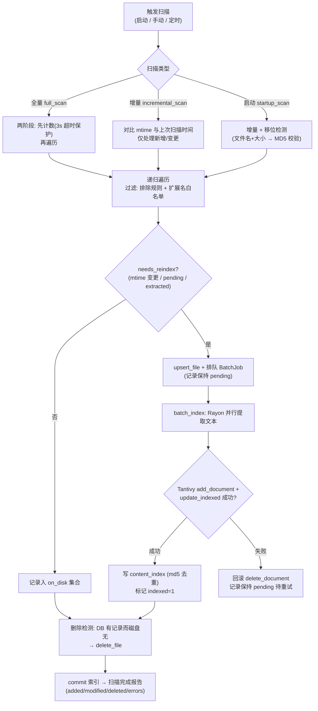
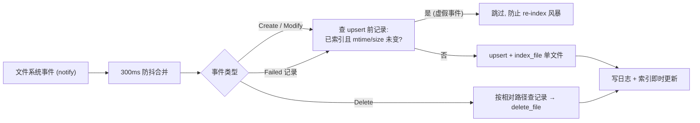
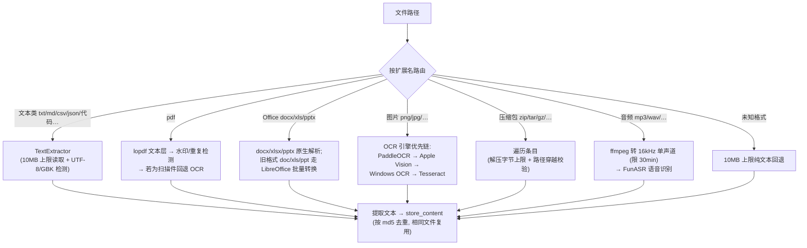
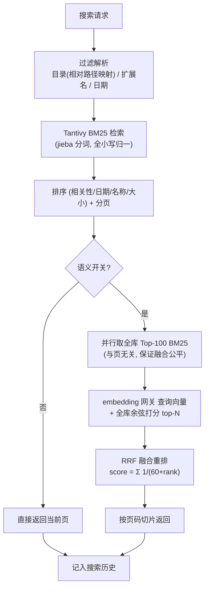
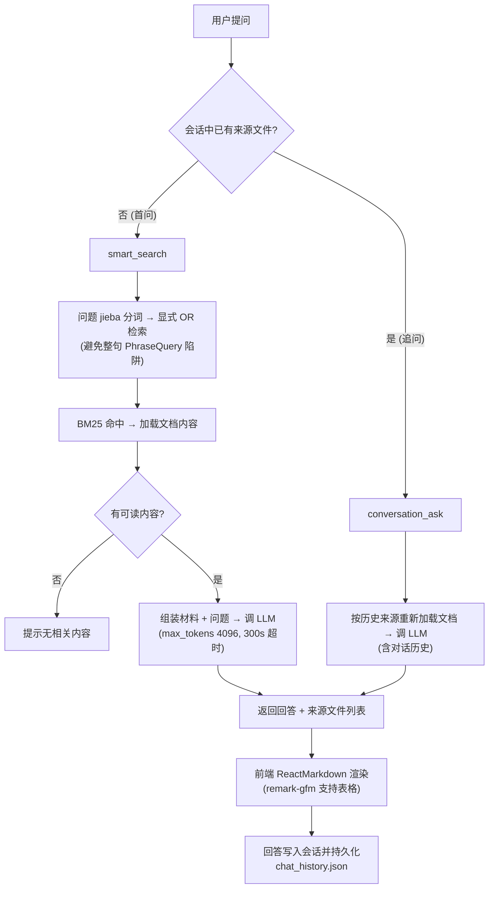
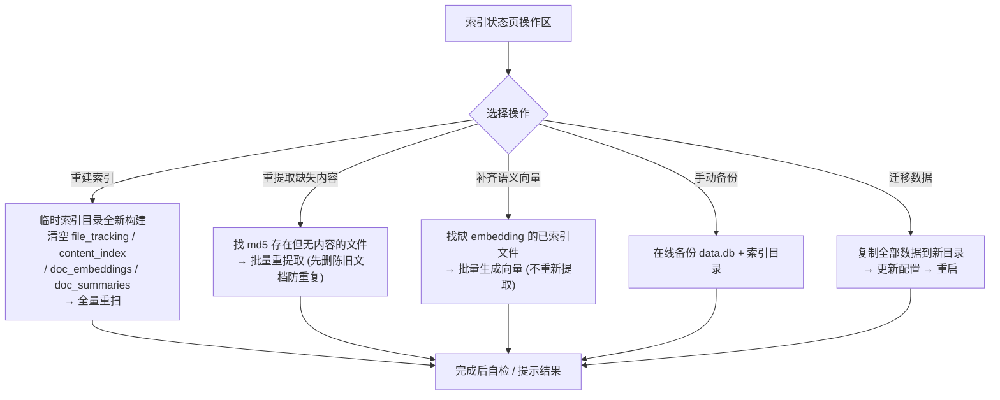

# Link-Searcher 用户手册

> 跨平台桌面全文搜索软件 —— 快速索引、搜索您的本地文档

---

## 目录

1. [快速上手](#1-快速上手)
2. [搜索](#2-搜索)
3. [浏览文件](#3-浏览文件)
4. [资料库管理](#4-资料库管理)
5. [索引管理](#5-索引管理)
6. [OCR 文字识别](#6-ocr-文字识别)
7. [设置](#7-设置)
8. [数据迁移与备份](#8-数据迁移与备份)
9. [命令行](#9-命令行)
10. [常见问题](#10-常见问题)

---

## 1. 快速上手

### 1.1 安装

Link-Searcher 使用 PaddleOCR 作为内置 OCR 引擎，**无需安装任何外部 OCR 软件**。

**前置条件**：Node.js 20+、Rust 1.85+

```bash
git clone https://github.com/Gray-Chan-sh/link-searcher.git
cd link-searcher
npm install
npm run tauri dev
```

首次启动自动编译 Rust 后端（约 2-5 分钟），之后启动很快。

**可选依赖**（需要时再装）：

| 工具 | 用途 | macOS | Windows | Linux |
|------|------|--------|---------|-------|
| Tesseract | 备选 OCR | `brew install tesseract tesseract-lang` | `winget install Tesseract-OCR` | `sudo apt install tesseract-ocr` |
| LibreOffice | 旧版 Office (.doc .ppt) | `brew install --cask libreoffice` | `winget install LibreOffice` | `sudo apt install libreoffice` |
| poppler | PDF 扫描件渲染 | `brew install poppler` | `winget install poppler` | `sudo apt install poppler-utils` |

### 1.2 三步开始

1. **添加资料库**：打开应用 → 「资料库」→ 「添加目录」
2. **等待扫描**：应用自动扫描。也可在「索引状态」手动触发
3. **搜索**：「搜索」→ 输入关键词 → Enter

---

## 2. 搜索

### 2.1 基本搜索

输入关键词，Enter 搜索。支持中文、英文、中英混合、短语匹配。

### 2.2 界面布局

搜索页为三栏布局：左侧筛选面板 + 中间结果列表 + 右侧预览面板。

### 2.3 筛选

- **目录筛选**：勾选目录树限定范围，父目录联动子目录
- **文件类型**：勾选扩展名过滤（.pdf .docx 等）
- **排序**：相关性 / 日期 / 文件名 / 文件大小

筛选条件自动保存到 localStorage，刷新不丢失。

### 2.4 高级查询

| 语法 | 示例 | 说明 |
|------|------|------|
| 通配符 | `doc*` | 后缀匹配 |
| 短语 | `"dog cat"` | 精确匹配 |
| AND | `cat AND dog` | 同时包含 |
| OR | `cat OR dog` | 任一包含 |
| NOT | `cat NOT dog` | 排除 |
| 分组 | `(cat OR dog) AND food` | 优先级 |
| 文件名 | `filename:report.pdf` | 正则匹配，任意位置 |

### 2.5 结果与预览

每条结果含文件名、路径、摘要（关键词高亮）、评分、时间、大小。

点击结果进入预览面板：文件信息、全文内容、PDF 标识、图片缩放、文字计数。

### 2.6 键盘操作

↑↓ 选择结果，Enter 打开预览。焦点在搜索框时 Enter 立即搜索。

### 2.7 其他功能

- **搜索建议**：输入时自动补全（基于 content_suggest 前缀查询）
- **模糊搜索**：容错距离 1（`finantial` → `financial`）
- **导出 CSV**：点击导出按钮，选择保存路径

### 2.8 语义搜索（✨ 按意思搜）

普通搜索按**字面**匹配——只有内容里出现过一样词的文件才会命中。语义搜索把文字转为数学向量，**按"意思"匹配**：即使文件里没出现你输入的原词，只要表达的意思相近就能命中。

> 例：搜「欠费催缴」可命中内容为「逾期未缴纳物业管理费」的文件；搜「违约金」可命中「滞纳金、逾期利息」相关的文档。

#### 使用前提

1. **配置 Embedding 网关**（见 7.5 节）：设置页 → 「AI 服务」→ Embedding 网关栏填 Base URL（本地 Ollama 填 `http://127.0.0.1:11434/v1`，云端按服务商地址）
2. **点击「测试连接」**：显示 ✓ 才能使用语义搜索；✗ 时语义按钮保持置灰并给出原因
3. **生成向量**：对**已索引**的历史文件，跑一次扫描（索引页「立即扫描」）自动补充向量；新文件在正常索引时自动生成

#### 使用步骤

1. 打开搜索页，在搜索框旁找到「✦ 语义」按钮
2. 点击启用（按钮变蓝），输入任何关键词搜索
3. 结果会**混合**两类匹配：关键词命中的 + 语义相近的，自动融合排序（RRF）

#### 与普通搜索的区别

| | 普通搜索 | 语义搜索 |
|---|---|---|
| 匹配方式 | 字面包含 | 语义相近（向量） |
| 同义/近义 | ✗ 漏掉 | ✓ 命中 |
| 模糊拼写 | 需模糊开关 | ✓ 容忍 |
| 速度 | 快 | 稍慢（需计算相似度） |
| 前提 | 无需配置 | 需 Embedding 网关 + 向量已生成 |

#### 注意事项

- **向量在索引时生成**：刚配置网关后，历史文件需触发一次扫描才有向量；期间语义搜索可能结果不全
- **未配置网关时**：语义按钮置灰 + 提示，普通搜索不受影响
- **网关测试失败时**：功能禁用（见设置页测试结果），修复配置后需重新「测试连接」生效

---

## 3. 浏览文件

浏览页提供文件系统视角，三栏布局：目录树 + 文件列表 + 预览。

### 3.1 状态筛选

文件列表上方下拉选择器：

| 选项 | 说明 | 图标 |
|------|------|:---:|
| 全部 | 所有文件 | — |
| 已索引 | 已成功索引 | 🟢 绿色 |
| 未索引 | 待处理 | ⚪ 灰色 |
| 失败 | 索引失败 | 🔴 红色 + ⚠️ |

悬停 ⚠️ 查看失败原因。

### 3.2 右键菜单

在文件行上右键弹出菜单：

| 菜单项 | 说明 |
|--------|------|
| 打开 | 用系统默认应用打开该文件 |
| 在文件夹中显示 | 在 Finder / 文件管理器中定位该文件 |
| 手动索引 | 重新索引该文件；对已索引的文件会先弹出确认框（避免误覆盖） |

### 3.3 列表操作

- **列宽拖拽**：鼠标悬停表头列边界，拖动可调整各列宽度。
- **类型/搜索/排序**：按扩展名筛选、按文件名搜索、按名称/大小/时间/扩展名排序。
- **分页**：上/下页按钮 + 页码输入框（Enter 或失焦跳转，自动限制在有效范围）。

---

## 4. 资料库管理

### 4.1 添加目录

「资料库」→ 「添加目录」→ 选择文件夹。支持拖拽添加。

### 4.2 目录配置

每目录可配：别名、OCR 语言、排除模式（glob）、包含类型、递归开关。

### 4.3 排除规则

**默认排除**（无需配置）：

| 规则 | 示例 |
|------|------|
| `#` 开头 | `#temp.md` |
| `$` 开头 | `$recycle` |
| `.` 开头 | `.DS_Store` `.gitignore` |
| `~` 开头 | `~$temp.docx` |
| `.tmp` `.temp` `.bak` `.swp` `.swo` `~` 结尾 | `data.tmp` |
| 精确名 | `.DS_Store` `Thumbs.db` `.git` `.svn` `__pycache__` |

用户可添加额外 glob 规则：`*.log` `node_modules/*` `build/*`。

### 4.4 删除目录

点击删除图标 → 确认对话框 → 删除（含索引数据）。

---

## 5. 索引管理

### 5.1 状态页面

显示：文件总数、已索引、待处理、失败、上次扫描时间。

### 5.2 Recent Changes

最近一次扫描的变更统计：新增、修改、删除、失败。

### 5.3 文件类型分布

各格式文件的数量统计（来自数据库真实数据）。支持 `.zip` `.tar` `.tar.gz` 等压缩包格式，包内文件自动递归提取。支持 `.mp3` `.wav` `.m4a` 等音频文件，自动语音识别为文字（含说话人标签），支持吴语等方言。

### 5.4 扫描操作

| 操作 | 说明 |
|------|------|
| 增量扫描 | 仅扫新增/修改的文件 |
| 全量扫描 | 重新扫全部 |
| 重建索引 | 清空从头构建 |
| 取消扫描 | 中途取消 |

### 5.5 自动扫描与监控

- **启动扫描**：应用启动时自动增量扫描
- **实时监控**：持续监控目录，文件变更实时同步
- **移位检测**：MD5 识别被移动文件，更新路径不重提取

---

## 6. OCR 文字识别

### 6.1 内置引擎

**PaddleOCR**（PP-OCRv5 模型），纯 Rust ONNX 推理，零依赖，模型编译进二进制（~21MB）。

- 图片：直接 OCR 识别
- 扫描件 PDF：pdftoppm 渲染（200 DPI）→ 多页并行 OCR（引擎池，页面按序汇总）
- 多页 PDF 的 OCR 并发度由设置 → OCR 并发数控制（默认 2，上限 8）

### 6.2 引擎选择

设置 → OCR 引擎：PaddleOCR（默认）/ Tesseract（备选）。
点击「测试引擎」验证可用性。

---

## 7. 设置

| 分类 | 设置项 | 说明 |
|------|--------|------|
| 常规 | 主题 | 浅色/深色/跟随系统 |
| 常规 | 最大结果数 | 单次搜索上限（默认 100） |
| 常规 | 开机自启 | 随系统启动 |
| OCR | OCR 引擎 | PaddleOCR / Tesseract |
| OCR | OCR 语言 | eng / chi_sim / jpn / kor |
| OCR | OCR 并发数 | 同时处理数（默认 2） |
| 排除 | 全局排除模式 | 额外 glob 规则 |
| 备份 | 自动备份 | 启用 + 间隔天数 |
| 高级 | LO 路径 | LibreOffice 可执行文件路径（留空自动探测：macOS 依次查 brew `/opt/homebrew/bin/soffice`、`/usr/local/bin/soffice`、`/Applications/LibreOffice.app/...`） |
| 高级 | LO 批大小 | 每次 soffice 转换文件数（1–100，默认 32）。越小越省内存，越大越快 |
| AI 服务 | Embedding Base URL | 语义搜索网关（Ollama / OneAPI / vLLM 等）。**留空关闭语义搜索** |
| AI 服务 | Embedding API Key | 语义搜索网关密钥（本地 Ollama 可留空） |
| AI 服务 | Embedding 模型 | 语义搜索用嵌入模型名（默认 text-embedding-v3-small） |
| AI 服务 | LLM Base URL | AI 摘要/问答网关（可与 Embedding 不同服务器）。**留空关闭摘要与问答** |
| AI 服务 | LLM API Key | 摘要/问答网关密钥（本地 Ollama 可留空） |
| AI 服务 | LLM 模型 | 摘要与问答用模型名（默认 qwen2.5-7b-instruct） |
| AI 服务 | 测试连接 | 分别测试两个网关连通性，实时显示 ✓/✗；✗ 时对应 AI 功能禁用 |

**所有设置项即时自动保存。**

---

## 7.5 AI 功能（可选）

配置好「AI 服务」后可用（Embedding 与 LLM 是两组独立网关，可指向不同服务器）：

- **语义搜索**：搜索页点击「✦ 语义」按钮——按"意思"而非仅按"字面"匹配。完整用法（前提、步骤、区别、注意事项）见上文 **2.8 语义搜索** 节。
- **文档摘要**：预览面板点击「✦ AI 摘要」，大模型生成该文档的要点总结（自动缓存，再次打开秒回）。依赖 LLM 网关。
- **跨文件问答**：浏览页多选文件 → 底部「问 AI」输入问题 → 基于选中文件的内容回答。适合"对比多份合同""总结这批材料"。依赖 LLM 网关。

**可用性提示**：设置页点「测试连接」可分别验证 Embedding / LLM 网关。未配置或测试不通过的网关，对应功能自动置灰禁用（搜索页语义按钮、预览摘要按钮、浏览问答条），tooltip 会引导到设置页配置。

> **隐私提示**：以上功能会把文档文本发送到你配置的网关。本地 Ollama（127.0.0.1）可做到内容不出本机；不配置则功能不出现，其他功能不受影响。

---

## 8. 数据迁移与备份

### 8.1 存储位置

- **macOS**：`~/Library/Application Support/link-searcher/`
- **Windows**：`%APPDATA%\link-searcher\`
- **Linux**：`~/.local/share/link-searcher/`

内容：`data.db` + `index/` + `app.log` + `backups/` + `models/funasr/`

> **FunASR 模型下载位置**：设置页"下载 FunASR 模型"存入 `数据目录/models/funasr/`（如上），与数据库/索引同源。**只需下载一次，升级重装 app 后仍在**。
>
> **开发版（`npm run tauri dev`）**：优先从项目 `src-tauri/models/funasr/` 读取——两台位置任选其一即可；**打包版（.app/安装包）只认数据目录**。若打包版检测不到模型，请确认模型在数据目录而非项目目录。

### 8.2 迁移数据

设置 → 「迁移数据」 → 选择新目录 → 自动复制 → 重启生效。

### 8.3 跨平台索引

路径存储为相对路径，同目录在不同 OS 可共享索引。

---

## 9. 命令行

```bash
link-searcher search "关键词"    # 搜索
link-searcher health             # 健康检查
```

---

## 10. 常见问题

**Q: 搜索速度？** 10 万文档 < 50ms。

**Q: 文件未索引？** 可能被排除规则匹配、权限不足、格式不支持。

**Q: 音频文件支持？** 支持 mp3/wav/m4a/aac/flac/ogg 等格式。首次使用时在**设置页**点击「下载 FunASR 模型」（~850MB，sherpa-onnx 纯 Rust 推理，无需 Python/torch），下载完成后离线可用。支持吴语/粤语/闽语等 7 大方言识别。注意：纯 Rust 版本不再输出「说话人分离」（`[Speaker X]`）标注。

**Q: 索引大小？** 约为原始文档 2–25%。

**Q: 内存？** 空闲 65MB，扫描 100-200MB，搜索 80-120MB。

**Q: 重建索引？** 索引状态页 → 「重建索引」。

**Q: 中文搜不到？** 确保 UTF-8 编码。PaddleOCR 无需额外配置。

**Q: CSV 乱码？** 用 UTF-8 编码打开。

---

*© 2026 Link-Searcher. MIT License.*

---

## 附录：功能模块流程图

以下流程图基于当前实现绘制，帮助理解各模块的内部运转。

### A. 文件扫描与索引



### B. 实时文件监控



### C. 文本提取管线



### D. 搜索流程



### E. AI 问答（RAG）



### F. 数据生命周期（索引页操作）



*© 2026 Link-Searcher. MIT License.*
