# Link-Searcher 用户手册

> 跨平台桌面全文搜索软件 —— 快速索引、搜索您的本地文档

---

## 目录

1. [认识 Link-Searcher](#1-认识-link-searcher)
2. [快速上手](#2-快速上手)
3. [搜索入门](#3-搜索入门)
4. [AI 增强功能](#4-ai-增强功能)
5. [浏览文件](#5-浏览文件)
6. [资料库管理](#6-资料库管理)
7. [索引管理](#7-索引管理)
8. [设置详解](#8-设置详解)
9. [数据迁移与备份](#9-数据迁移与备份)
10. [命令行](#10-命令行)
11. [常见问题](#11-常见问题)

---

## 1. 认识 Link-Searcher

Link-Searcher 是一款**本地全文搜索**桌面应用。它能快速扫描您指定的文件夹，提取文档内容并建立索引，之后您就可以像使用搜索引擎一样搜索本地文件——按关键词、按短语、按文件类型，甚至按"意思"搜。

### 核心能力

| 能力 | 说明 |
|------|------|
| **全文搜索** | 搜索文件内部文字，不仅是文件名 |
| **OCR 文字识别** | 图片和扫描件 PDF 中的文字也能搜到 |
| **语义搜索** | 按"意思"匹配，搜同义词、近义词 |
| **AI 问答** | 基于文档内容提问，AI 根据找到的资料回答 |
| **多格式** | 支持 PDF、Office、图片、音频、代码等 30+ 种格式 |
| **本地部署** | 所有数据存在本地，不依赖网络 |

### 界面总览

启动后，应用分三部分：


> **图 1：搜索页全貌**——左侧为导航栏与筛选面板，中间为结果列表，右侧为预览面板（空态时显示引导文字）。

| 区域 | 功能 |
|------|------|
| **左侧导航栏** | 切换页面：搜索、AI 聊天、浏览、资料库、索引状态、日志、文件类型、设置 |
| **左侧筛选面板** | 按目录树、文件类型筛选搜索结果 |
| **主内容区** | 搜索框、结果列表、预览面板 |
| **底部状态栏** | 显示文件总数、已索引数、OCR 进度、上次扫描时间 |

---

## 2. 快速上手

### 2.1 安装

Link-Searcher 使用内置 PaddleOCR 引擎，**无需安装任何额外 OCR 软件**。

**下载预编译包**（推荐）：
从 [Releases 页面](https://github.com/Gray-Chan-sh/link-searcher/releases) 下载对应平台安装包：
- macOS → `.dmg`
- Windows → `.msi`
- Linux → `.deb` / `.AppImage`

**从源码运行**：
```bash
git clone https://github.com/Gray-Chan-sh/link-searcher.git
cd link-searcher
npm install
npm run tauri dev
```

首次启动会自动编译 Rust 后端（约 2-5 分钟），之后启动很快。

**可选依赖**（需要时再装）：

| 工具 | 用途 | macOS | Windows | Linux |
|------|------|--------|---------|-------|
| Tesseract | 备选 OCR | `brew install tesseract tesseract-lang` | `winget install Tesseract-OCR` | `sudo apt install tesseract-ocr` |
| poppler | PDF 扫描件渲染 | `brew install poppler` | `winget install poppler` | `sudo apt install poppler-utils` |
| ffmpeg | 音频识别 | `brew install ffmpeg` | `winget install ffmpeg` | `sudo apt install ffmpeg` |

### 2.2 三步开始

1. **添加资料库**：打开应用 → 左侧导航栏「资料库」→ 点击「+ 添加目录」，选择包含文档的文件夹。
2. **等待扫描**：应用会自动扫描目录中的文件并提取文字建立索引。您可以在「索引状态」页查看进度。
3. **搜索**：导航到「搜索」页，输入关键词，按 Enter 回车。结果会立刻呈现。

> 💡 首次启动时，会弹出**新手引导**向导，带您一步步完成上述操作。

### 2.3 资料库示例

本手册使用以下演示资料库展示功能：

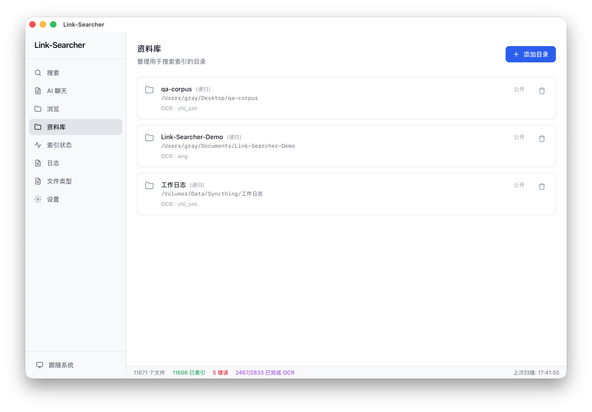

> **图 2：资料库管理页**——列出已添加的目录，可配置排除规则、OCR 语言等。

演示资料库包含以下文件（覆盖各类场景）：

| 文件 | 格式 | 说明 |
|------|------|------|
| `2026年度预算表.xlsx` | Excel | 财务预算数据 |
| `2026年Q3季度财务报表.xlsx` | Excel | 季度财务报表 |
| `软件采购合同.docx` | Word | 合同文书（含违约金条款） |
| `房屋租赁合同.docx` | Word | 租赁合同（含押金条款） |
| `2025年度市场分析报告.docx` | Word | 市场分析报告 |
| `数字化转型白皮书.pdf` | PDF | 数字转型报告 |
| `李明-软件工程师简历.docx` | Word | 个人简历 |
| `王芳-产品经理简历.pdf` | PDF | 产品经理简历 |
| `2026-08-10 项目周会纪要.md` | Markdown | 会议纪要 |
| `产品评审会议纪要.md` | Markdown | 产品评审 |
| `读书笔记-人工智能简史.md` | Markdown | 读书笔记 |
| `项目技术方案.txt` | 文本 | 技术方案文档 |
| `新品发布路演.pptx` | PPT | 演示文稿 |
| `销售数据.csv` | 表格 | 销售数据 |
| `发票样本.png` | 图片 | 增值税发票（OCR 演示） |
| `会议现场照片.png` | 图片 | 会议现场文字（OCR 演示） |
| `扫描件-服务协议.pdf` | PDF（扫描件） | 无文字层 PDF（OCR 演示） |

---

## 3. 搜索入门

### 3.1 基本搜索

在搜索页顶部的搜索框中输入关键词，按 Enter 键即可搜索。支持中文、英文、中英混合、短语匹配。


> **图 3：搜索页**——顶部搜索框、左侧筛选面板、中间结果区。

### 3.2 筛选结果

左侧筛选面板可以缩小搜索范围：

- **目录筛选**：勾选目录树中的目录，只搜索特定文件夹。父目录与子目录联动——勾选父目录自动包含子目录。
- **文件类型**：勾选扩展名（.pdf、.docx、.png 等），只搜索指定格式。


> **图 4：筛选面板**——目录树在上方，文件类型勾选在下方。

筛选条件**自动保存**到浏览器本地存储，刷新页面不丢失。

### 3.3 高级查询语法

搜索框支持丰富的查询语法：

| 语法 | 示例 | 说明 |
|------|------|------|
| 通配符 | `doc*` | 后缀匹配——匹配 document、docx 等 |
| 短语 | `"dog cat"` | 精确匹配——必须完全按顺序出现 |
| AND | `cat AND dog` | 同时包含两个词 |
| OR | `cat OR dog` | 包含任一词即可 |
| NOT | `cat NOT dog` | 排除包含 dog 的文档 |
| 分组 | `(cat OR dog) AND food` | 优先级控制 |
| 文件名 | `filename:report.pdf` | 正则匹配文件名（任意位置） |

> 💡 **提示**：通配符 `*` 只匹配**后缀**（如 `doc*` 匹配 `docx`、`document`），不匹配前缀。

### 3.4 语义搜索

搜索框右侧的 **✦ 语义** 按钮开启语义搜索——按"意思"而非仅按"字面"匹配。


> **图 5：搜索框与语义按钮**——点击「✦ 语义」按钮启用（需要先配置 AI 服务，见第 4 章）。

**原理**：普通搜索按关键词匹配，语义搜索把文字转为数学向量，找"意思相近"的内容。例如搜「欠费催缴」可命中"逾期未缴纳物业管理费"的文件。

**使用前提**：
1. 在设置页 → AI 标签页配置 Embedding 网关（见第 8.4 节）
2. 点击「测试连接」显示 ✓ 后即可使用
3. 对已索引的历史文件，需要跑一次扫描补充向量（索引页「补齐语义向量」）

### 3.5 结果与预览

搜索结果展示：文件名、路径、摘要（关键词高亮）、评分、时间、大小。


> **图 6：搜索结果列表**——每条结果含文件名、路径、内容摘要。

点击结果进入预览面板：

- **文件信息**：类型、大小、修改时间、路径
- **全文内容**：文档正文（文字截断 5 万字符）
- **PDF 标识**：显示 PDF 页码
- **图片缩放**：图片文件可缩放查看
- **文字计数**：显示文档字数
- **AI 摘要**（需配置 LLM）：点击「✦ AI 摘要」生成文档要点总结

### 3.6 搜索流程（技术示意）

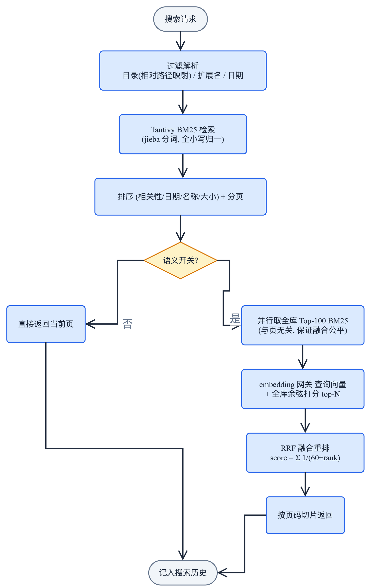

> **图 6：搜索流程**——搜索请求经 BM25 检索、语义融合后返回结果，全程记入历史。

### 3.7 键盘操作

| 操作 | 效果 |
|------|------|
| ↑↓ | 在结果列表中移动选择 |
| Enter | 打开选中的结果预览 |
| Enter（搜索框焦点） | 立即搜索 |
| ⌘K | 聚焦搜索框 |

### 3.8 其他功能

- **搜索建议**：输入时自动补全（基于内容前缀查询）
- **模糊搜索**：容错距离 1（如 `finantial` 也能匹配 `financial`）
- **导出 CSV**：点击导出按钮，选择保存路径即可导出搜索结果

---

## 4. AI 增强功能

### 4.1 配置前提

AI 功能需要配置网关（支持 OpenAI 兼容的 API：Ollama / OneAPI / vLLM / 各类中转）。


> **图 7：AI 服务设置**——添加 Provider、选择 Embedding 与 LLM 模型。

**配置步骤**：
1. 进入设置页 → **AI** 标签页
2. 点击「添加 Provider」，填写名称 + Base URL（OpenAI 兼容地址）+ API Key（本地 Ollama 可留空）
3. 保存时自动拉取模型列表，按名字分类为 embedding / LLM
4. 在「当前使用」下拉框中分别选择 Embedding 模型与 LLM 模型
5. 点击「测试连接」验证连通性

> **隐私提示**：启用后文档文本会发送到您配置的网关。使用本地 Ollama（127.0.0.1）可做到内容不出本机。不配置则 AI 功能自动隐藏，其他功能不受影响。

### 4.2 语义搜索

配置 Embedding 后，搜索页的「✦ 语义」按钮可用。点击开启后，搜索结果会**混合**两类匹配——关键词命中的 + 语义相近的，按可调权重融合。

**权重调节**：设置页 → AI →「检索策略」滑杆，控制语义与关键词的占比（默认语义 30% / 关键词 70%）。拖向"语义"找"意思相近"，拖向"关键词"找精确短语。

| 对比 | 普通搜索 | 语义搜索 |
|------|---------|---------|
| 匹配方式 | 字面包含 | 语义相近（向量） |
| 同义/近义 | ✗ 漏掉 | ✓ 命中 |
| 模糊拼写 | 需模糊开关 | ✓ 容忍 |
| 速度 | 快 | 稍慢（需计算相似度） |
| 前提 | 无需配置 | 需 Embedding 网关 + 向量已生成 |

### 4.3 文档摘要

预览面板点击「✦ AI 摘要」按钮，大模型生成该文档的要点总结。摘要自动缓存，再次打开秒回。依赖 LLM 模型。

### 4.4 跨文件问答

在浏览页中多选文件（Cmd/Ctrl+单击或 Shift 区间），底部出现「问 AI」输入框——输入问题后，AI 会基于选中文件的内容回答。适合"对比多份合同""总结这批材料"等场景。依赖 LLM 模型。

### 4.5 AI 聊天


> **图 8：AI 聊天页面**——多轮对话式文档检索，支持精确控制检索范围。

AI 聊天页提供**多轮对话**式文档检索，首问自动检索文档，追问重新检索 + 合并对话中提到的旧文件。

**检索范围控制**：

| 方式 | 操作 | 示例 |
|------|------|------|
| **@ 文件** | 输入 `@` 弹出文件/目录选择器，选中即插入 `@路径` | `@财务/年度报告.md 汇总收入` |
| **@ 目录** | 同上，选择目录或树状目录右键「加入对话」 | `@财务 本季度收入` |
| **条件命令** | 输入 `/ext:pdf` `/date:2025-01-01~2025-12-31` —— 作为 AND 条件过滤 | `/ext:pdf 年度报告` |
| **会话范围** | 树状浏览器目录后「范围」按钮设当前目录为会话范围 | `/范围:财务` |
| **严格模式** | 输入框上方「仅依据文档」开关——范围内无命中时明确告知"未找到依据" | 点击 toggle |
| **专注模式** | 文件右键「专注分析」——会话仅分析该文件 | 文件右键 |

**编号引用**：`@文件` 在发送给 LLM 前替换为 `[N]` 编号，回答中引用精确（如"根据[1]、[2]统计总人数"）。

**追溯面板**：每条回答下方可折叠「🔍 检索依据」面板，展示每份来源的 BM25 分、语义相似度、RRF 融合分。

### 4.6 AI 问答流程（技术示意）

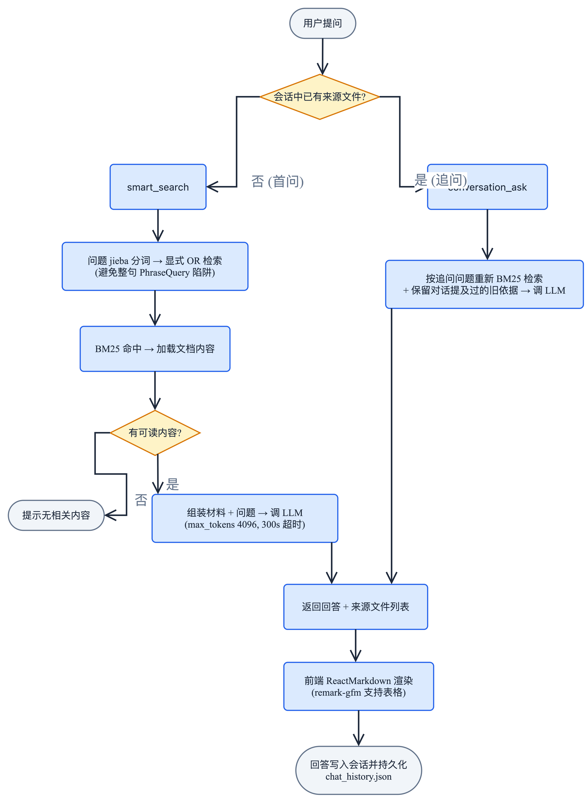

> **图 8：AI 问答流程**——首问经 smart_search 检索，追问经 conversation_ask 重检索，合并后调 LLM 回答。

---

## 5. 浏览文件

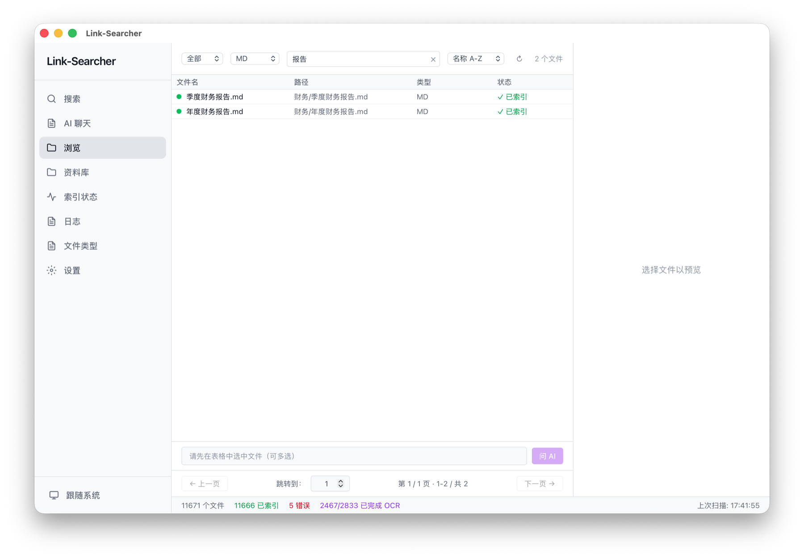

> **图 9：浏览页**——表格视图，按索引状态筛选。

浏览页提供文件系统视角，三栏布局：目录树 + 文件列表 + 预览。

### 5.1 状态筛选

文件列表上方下拉选择器，按索引状态过滤：

| 选项 | 说明 | 图标 |
|------|------|:---:|
| 全部 | 所有文件 | — |
| 已索引 | 已成功索引 | 🟢 绿色 |
| 未索引 | 待处理 | ⚪ 灰色 |
| 失败 | 索引失败 | 🔴 红色 + ⚠️ |

悬停 ⚠️ 图标可查看失败原因。

### 5.2 列表操作

- **列宽拖拽**：鼠标悬停表头列边界，拖动可调整各列宽度
- **类型/搜索/排序**：按扩展名筛选、按文件名搜索、按名称/大小/时间/扩展名排序
- **分页**：上/下页按钮 + 页码输入框（Enter 或失焦跳转，自动限制在有效范围）
- **多选**：Cmd/Ctrl+单击多选，或 Shift 区间多选，支持批量操作

### 5.3 右键菜单

在文件行上右键弹出菜单：

| 菜单项 | 说明 |
|--------|------|
| 打开 | 用系统默认应用打开该文件 |
| 在文件夹中显示 | 在 Finder / 文件管理器中定位该文件 |
| 手动索引 | 重新索引该文件；对已索引的文件会先弹出确认框 |
| 批量重新索引 | 多选文件后，一次性提交所有选中文件重新索引 |

---

## 6. 资料库管理


> **图 10：资料库管理页**——添加、配置、删除监控目录。

### 6.1 添加目录

点击「+ 添加目录」→ 选择文件夹。支持拖拽添加。

### 6.2 目录配置

每个目录可配置：

| 配置项 | 说明 |
|--------|------|
| **别名** | 给目录起个容易识别的名字 |
| **OCR 语言** | 指定 OCR 识别语言（如 chi_sim 中文简体） |
| **排除模式** | glob 规则排除文件（如 `*.log`、`node_modules/*`） |
| **包含类型** | 只索引指定扩展名（如 `.pdf,.docx`） |
| **递归开关** | 是否递归子目录 |

> 修改配置后保存，会自动对该目录触发一次**增量扫描**，变更立即生效。

### 6.3 私密目录

在目录配置中可将目录标记为**私密**——标记后该目录下的文件**不会被索引**，也不会出现在搜索结果中。适合存放个人隐私文件。

### 6.4 排除规则

**默认排除**（无需配置）：

| 规则 | 示例 |
|------|------|
| `#` 开头 | `#temp.md` |
| `$` 开头 | `$recycle` |
| `.` 开头 | `.DS_Store` `.gitignore` |
| `~` 开头 | `~$temp.docx` |
| `.tmp` `.temp` `.bak` `.swp` `.swo` `~` 结尾 | `data.tmp` |
| 精确名 | `.DS_Store` `Thumbs.db` `.git` `.svn` `__pycache__` |

用户可添加额外 glob 规则：`*.log` `node_modules/*` `build/*`。

### 6.5 删除目录

点击删除图标 → 确认对话框 → 删除（含索引数据）。

---

## 7. 索引管理

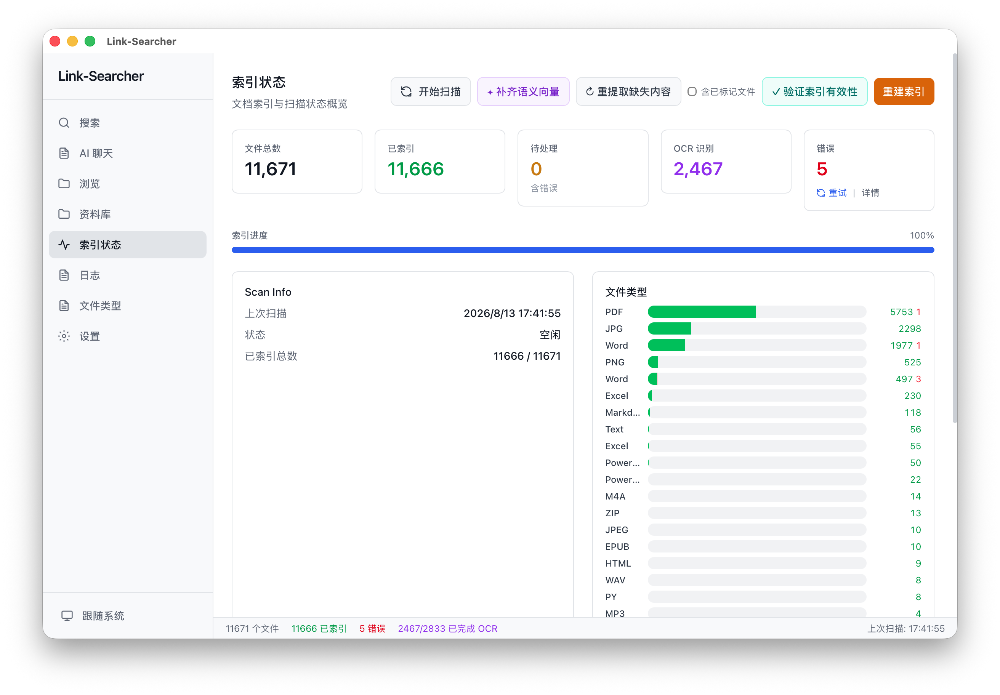

> **图 11：索引状态页**——统计卡片、文件类型分布、扫描操作。

### 7.1 状态统计

页面顶部显示：文件总数、已索引、待处理、失败、上次扫描时间。

### 7.2 Recent Changes

最近一次扫描的变更统计：新增、修改、删除、失败。

### 7.3 文件类型分布


> **图 12：文件类型分布页**——各格式文件数量统计，含依赖状态检查。

### 7.4 扫描操作

| 操作 | 说明 |
|------|------|
| 增量扫描 | 仅处理新增/修改的文件 |
| 全量扫描 | 重新扫描全部文件 |
| 重建索引 | 清空索引和数据库，全部从头构建 |
| 取消扫描 | 中途取消正在进行的扫描 |

**长任务操作**：

| 操作 | 说明 |
|------|------|
| 验证索引有效性 | 检查索引与数据库的一致性，修复不匹配 |
| 补齐语义向量 | 搜索缺 embedding 的已索引文件，批量生成向量 |
| 重提取缺失内容 | 找 md5 存在但内容已删除的文件，重新提取 |

### 7.5 任务简报

长任务完成后，**底部状态栏 📋 图标点亮**并显示结果摘要（如「索引有效性验证完成: 检查 N，恢复 N…」）。点击图标跳到日志页定位到该任务的 `[TASK]` 日志行。未点击前，切页/重启后图标保持点亮（已读状态持久化）。

### 7.6 日志查看


> **图 13：日志查看页**——按类型筛选、关键字过滤。

每次扫描自动生成独立日志文件 `data/logs/scan-{时间戳}.log`。日志页支持：
- **关键字过滤**：顶部输入框，按内容实时筛选
- **类型标签**：全部 / 索引 / OCR / 扫描 / 搜索 / 错误
- **自动刷新**：新日志实时追加

### 7.7 文件扫描与索引（技术示意）


> **图：文件扫描与索引流程**——三种扫描类型→递归遍历→按需索引→Tantivy 写入→删除检测→完成报告。

### 7.8 实时文件监控（技术示意）

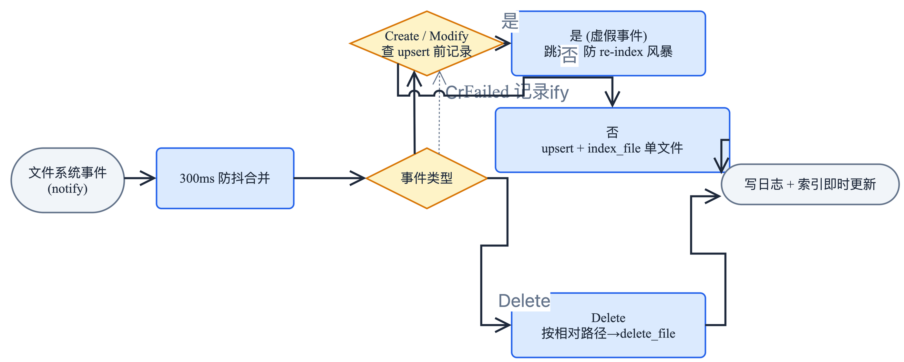

> **图：实时文件监控**——文件系统事件经 300ms 防抖、按类型分发处理，即时更新索引。

---

## 8. 设置详解

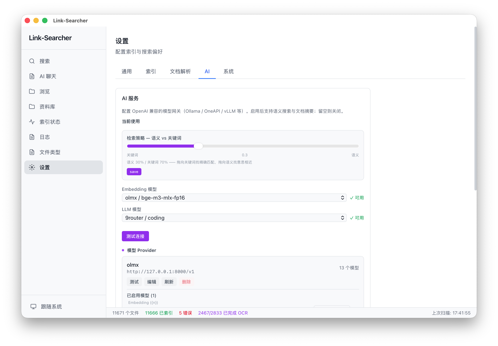

> **图 14：设置页**——分组标签页导航。

设置页分为五个标签页，各选项**即时自动保存**，无需手动点击保存按钮。

### 8.1 通用

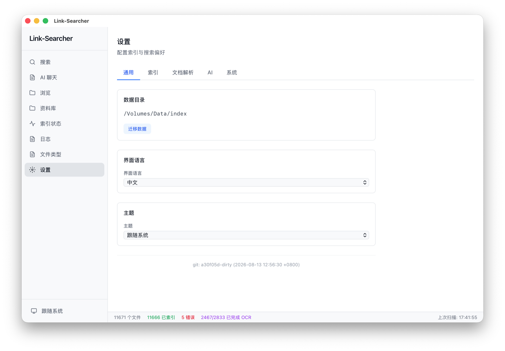

> **图 15：通用设置**——主题、语言、数据目录、迁移。

| 设置项 | 说明 |
|--------|------|
| **主题** | 浅色 / 深色 / 跟随系统，也可通过底部栏主题按钮快速切换 |
| **界面语言** | 中文 / English / 日本語 / 한국어，即时生效 |
| **数据目录** | 存储索引和数据库的路径，可一键迁移 |
| **迁移数据** | 复制所有数据到新目录 → 更新配置 → 重启生效 |

### 8.2 索引 / OCR

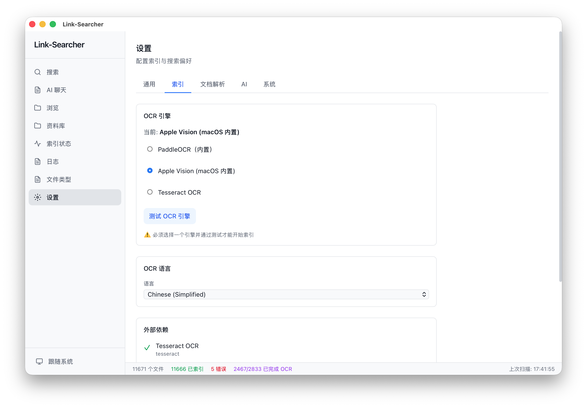

> **图 16：索引设置**——OCR 引擎选择、语言配置。

| 设置项 | 说明 |
|--------|------|
| **OCR 引擎** | PaddleOCR（内置）/ Tesseract（备选）。点击「测试引擎」验证可用性 |
| **OCR 语言** | eng / chi_sim / jpn / kor 等 |
| **OCR 并发数** | 同时处理多少页（默认 2，上限 8） |

### 8.3 文档解析

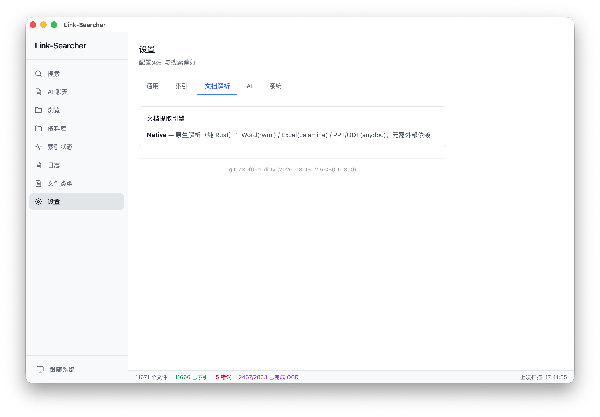

> **图 17：文档解析设置**——文本提取引擎配置。

### 8.4 AI 服务


> **图 18：AI 服务设置**——Provider 管理、模型选择与测试。

**添加 AI Provider**：
1. 填写名称 + Base URL（OpenAI 兼容地址）+ API Key
2. 保存时自动拉取模型列表，按名字分类为 embedding / LLM
3. 在「当前使用」下拉框分别选择 Embedding 模型与 LLM 模型
4. 不选 = 功能停用

**Provider 管理**：
- 每个 Provider 可「测试」连通性、「刷新」重拉模型列表
- 分类不准确时，可在 Provider 的模型子列表中手动改类型（embedding / LLM）
- 正在使用的 Provider 不可删除，需先切换当前模型

**配置后可用**：
- **语义搜索**：搜索页「✦ 语义」按钮（见 3.4 节）
- **文档摘要**：预览面板「✦ AI 摘要」（见 4.3 节）
- **跨文件问答**：浏览页多选 + 问 AI（见 4.4 节）
- **AI 聊天**：多轮对话式文档检索（见 4.5 节）

### 8.5 系统


> **图 19：系统设置**——开关机自启、自动备份、排除规则。

| 设置项 | 说明 |
|--------|------|
| **开机自启** | 随系统启动（macOS LaunchAgent / Windows 启动项） |
| **自动备份** | 启用 + 间隔天数，自动备份索引数据 |
| **搜索结果上限** | 单次搜索最大返回数（默认 100） |
| **排除规则** | 全局额外 glob 排除规则 |

---

## 9. 数据迁移与备份

### 9.1 存储位置

| 平台 | 数据目录 |
|------|---------|
| **macOS** | `~/Library/Application Support/link-searcher/` |
| **Windows** | `%APPDATA%\link-searcher\` |
| **Linux** | `~/.local/share/link-searcher/` |

目录内容：`data.db` + `index/` + `app.log` + `backups/` + `models/funasr/`

> **FunASR 模型**：下载位置在数据目录下的 `models/funasr/`，只需下载一次，升级重装后仍在。

### 9.2 迁移数据

设置 → 通用 →「迁移数据」→ 选择新目录 → 自动复制 → 重启生效。

### 9.3 备份

- **手动备份**：索引页操作区 →「手动备份」
- **自动备份**：设置 → 系统 → 启用自动备份 + 间隔天数

### 9.4 跨平台索引

文件路径存储为**相对路径**（相对于监控目录根），而非绝对路径。两个完全同步的目录在不同操作系统上可共享同一份索引数据。

### 9.5 数据生命周期（技术示意）

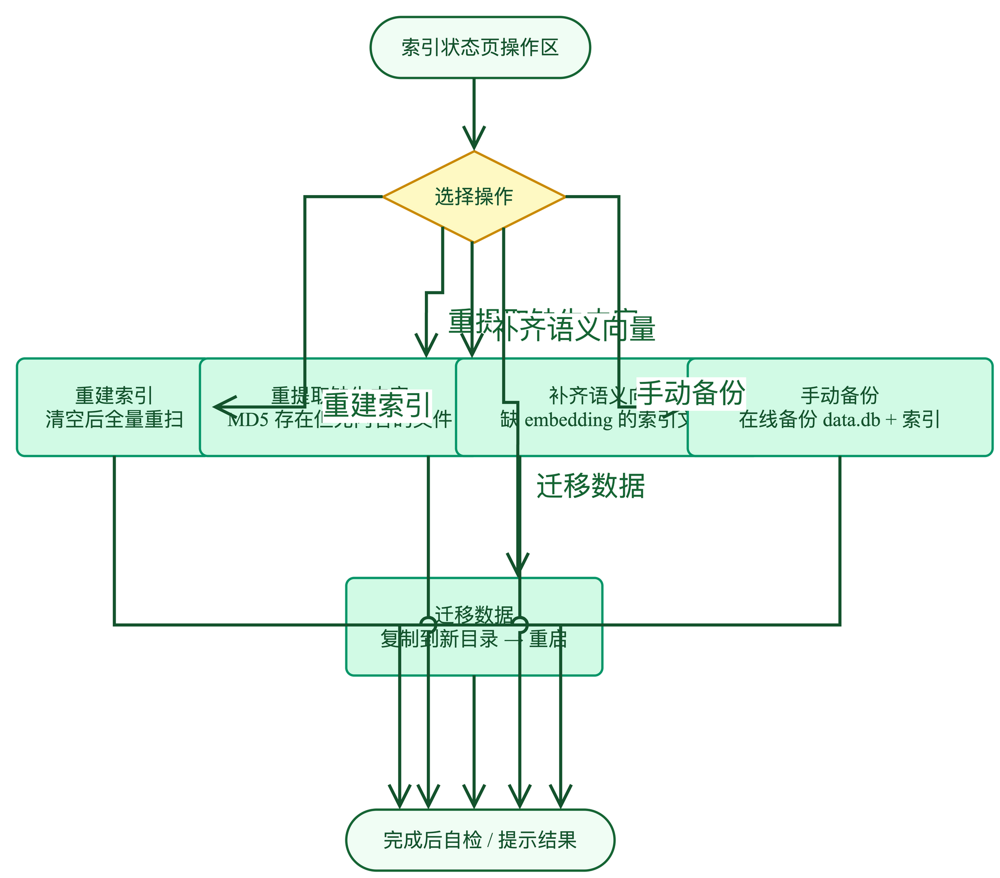

> **图：数据生命周期**——索引状态页的五种操作及其对应的数据处理流程。

---

## 10. 命令行

Link-Searcher 提供命令行接口，可与 GUI 共用同一数据目录。

```bash
link-searcher search "关键词"     # 搜索（别名 index）
link-searcher scan [目录]         # 扫描：省略目录则扫描全部已配置目录
link-searcher watch 目录          # 实时监控目录文件变更（Ctrl-C 退出）
link-searcher health              # 健康检查
```

示例：

```bash
$ link-searcher search "预算"
2026年度预算表.xlsx (xlsx): 15.23
2026年Q3季度财务报表.xlsx (xlsx): 12.10
--- 2 results in 4ms ---

$ link-searcher health
Link-Searcher index health check
  Data dir: /Users/xxx/Library/Application Support/link-searcher
  Index: OK
    Segments: 5
    Documents: 11666
  Database: OK
    Integrity check: ok
    Tracked files: 11671
    Indexed entries: 9207
```

> **注意**：CLI 与 GUI 共用同一数据目录；同时运行时存在写入锁竞争风险，请勿并行执行扫描类命令。

---

## 11. 常见问题

### 搜索相关

**Q: 搜索速度如何？**
A: 10 万文档 < 50ms，毫秒级响应。

**Q: 中文搜不到？**
A: 确保文档为 UTF-8 编码。PaddleOCR 内置支持中英文，无需额外配置。

**Q: 模糊搜索什么？**
A: 容错距离 1，自动纠正拼写错误（如 `finantial` → `financial`）。

**Q: CSV 导出乱码？**
A: 用 UTF-8 编码打开导出的 CSV 文件。

### 索引相关

**Q: 文件未索引？**
A: 可能原因：排除规则匹配、权限不足、格式不支持。

**Q: 索引多大？**
A: 约为原始文档的 2–25%。

**Q: 怎么重建索引？**
A: 索引状态页 → 「重建索引」。

**Q: 如何得知索引进度？**
A: 索引状态页查看统计，状态栏实时显示当前扫描进度。

### OCR 相关

**Q: 支持哪些图片格式？**
A: PNG、JPG、JPEG、GIF、BMP、WebP、TIFF，自动 OCR 识别文字。

**Q: 扫描件 PDF 能搜吗？**
A: 可以。扫描件 PDF 自动渲染为图片 → OCR 识别文字，与普通文档一样可搜索。

**Q: PaddleOCR 需要安装吗？**
A: 不需要。PaddleOCR 引擎已内置，模型编译进二进制（约 21MB），开箱即用。

### 音频相关

**Q: 支持哪些音频格式？**
A: mp3、wav、m4a、aac、flac、ogg 等。首次使用时在**设置页**点击「下载 FunASR 模型」（~850MB，纯 Rust 推理，无需 Python/torch），下载完成后离线可用。

**Q: 支持方言识别吗？**
A: 支持吴语、粤语、闽语等 7 大方言。

### 资源占用

**Q: 内存占用？**
A: 空闲约 65MB，扫描 100-200MB，搜索 80-120MB。

**Q: 启动为什么慢？**
A: 首次启动自动编译 Rust 后端（约 2-5 分钟），后续启动很快。

---

*© 2026 Link-Searcher. MIT License.*