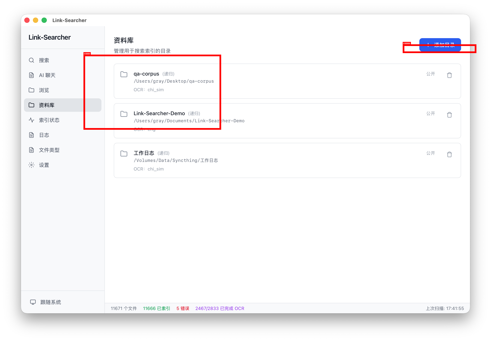

# 第二章：添加资料库

> 教你添加第一个文件夹到资料库，并管理已添加的目录。

---

## 步骤 1：进入资料库页面

在左侧导航栏中，点击「资料库」图标，进入资料库管理页面。

> 页面顶部显示「资料库」标题，右侧有「+ 添加目录」按钮。下方列出已添加的目录。

## 步骤 2：添加目录

点击「+ 添加目录」按钮，系统会弹出文件选择对话框。

1. 在弹出的对话框中选择你想要索引的文件夹
2. 如果要使用演示数据，选择 `~/Documents/Link-Searcher-Demo/` 目录
3. 点击「选择」或「打开」确认

> 目录添加后，会立即出现在资料库列表中，并自动触发一次全量扫描。

## 步骤 3：查看目录列表

添加成功后，目录会显示在列表中，包含以下信息：

| 信息 | 说明 |
|------|------|
| 目录名称 | 别名（若设置）或路径末段 |
| 路径 | 目录的完整路径 |
| 递归 | 是否递归子目录（添加时默认开启） |
| OCR 语言 | 文字识别语言（沿用全局设置） |
| 包含类型 | 限定的扩展名（若设置） |

> 该页面仅用于添加和删除目录；目录的 OCR 语言等选项在添加时确定，暂不支持在此页修改。

## 步骤 4：删除目录

如果不再需要某个目录：

1. 点击目录行右侧的删除图标
2. 在弹出的确认对话框中点击「确定」
3. 该目录及其索引数据将被删除

> 删除目录只会删除索引数据，不会删除原始文件。

## ✅ 本章验证清单

- [ ] 已进入资料库管理页面
- [ ] 已添加至少一个文件夹到资料库
- [ ] 已查看目录列表
- [ ] 已了解目录名称、路径、递归、OCR 语言等信息
- [ ] 已了解删除目录只删除索引数据，不删除原始文件