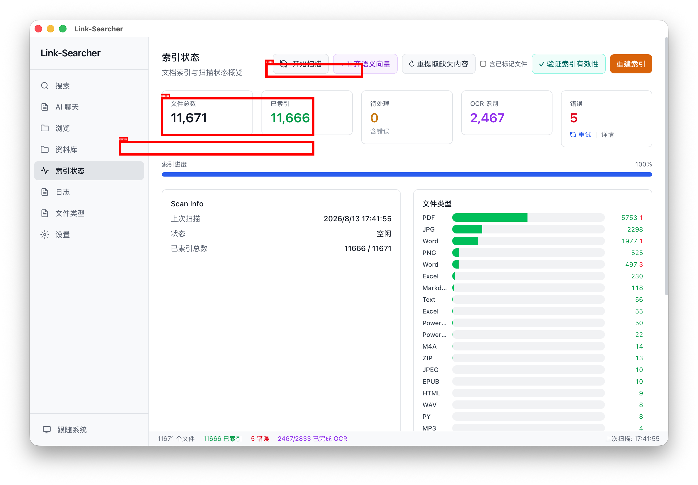
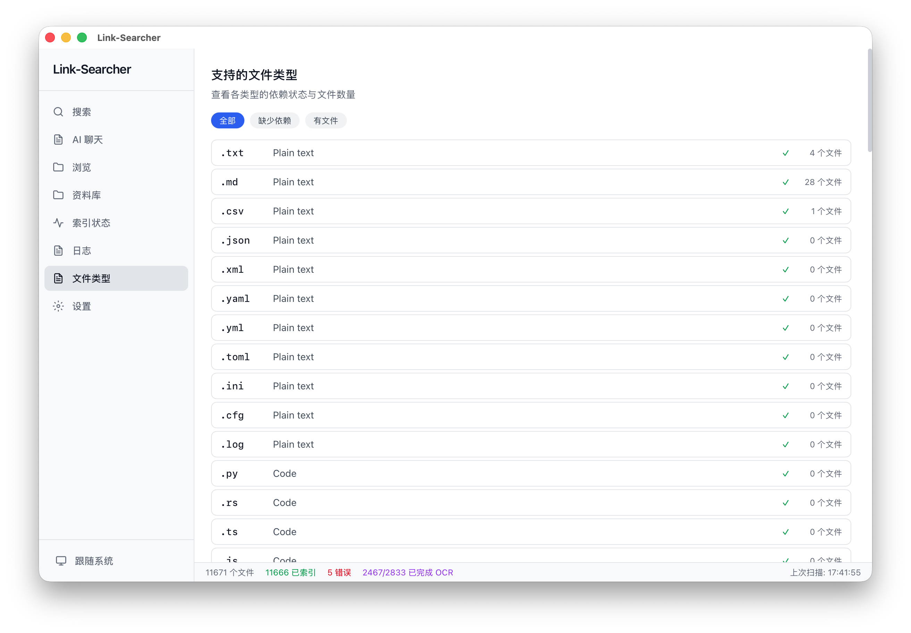
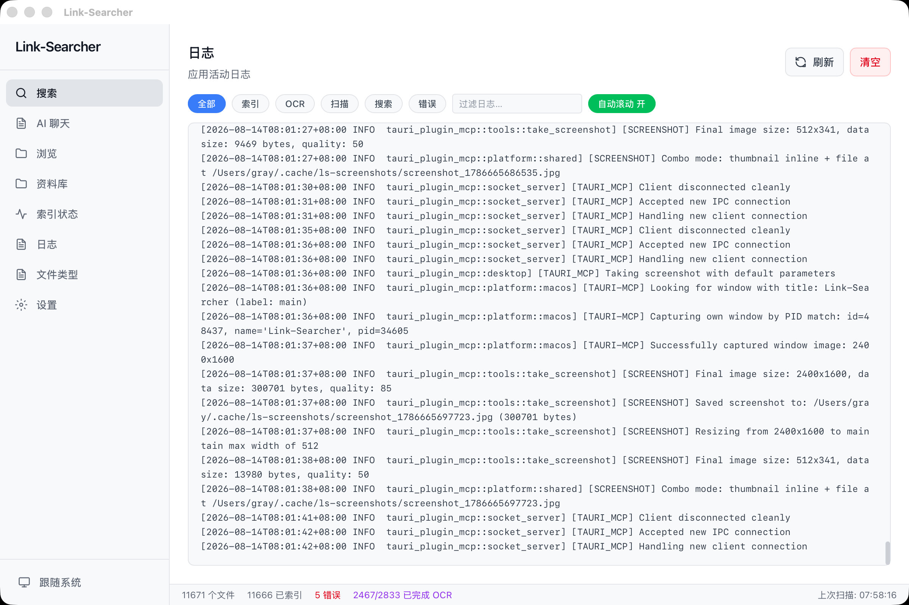
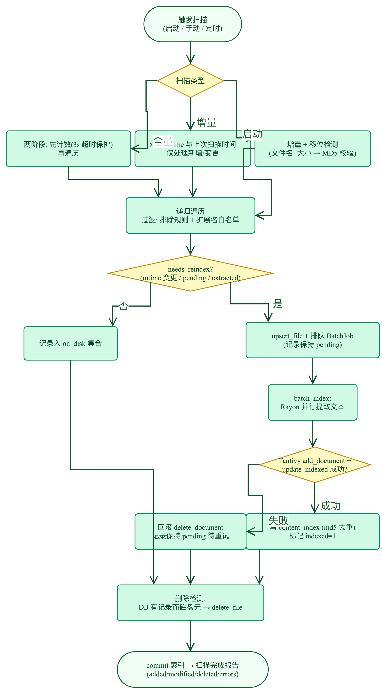

# 第三章：等待索引完成

> 了解索引过程，查看进度，确认文件已就绪。

---

## 步骤 1：查看索引状态

添加资料库后，应用会自动开始扫描和索引文件。点击左侧导航栏的「索引状态」查看进度。

页面顶部显示四个统计卡片：

| 统计项 | 说明 |
|--------|------|
| 文件总数 | 资料库中所有文件的数量 |
| 已索引 | 已成功提取文字并加入索引的文件数 |
| 待处理 | 排队等待处理的文件数 |
| 错误 | 索引失败的文件数（含失败原因） |

## 步骤 2：查看索引进度

统计卡片下方有**索引进度条**，显示当前完成的百分比。

- 扫描进行中时，状态栏显示「正在扫描…」
- 扫描完成后，状态变为「空闲」
- 「上次扫描时间」显示最近一次完成的时间

## 步骤 3：查看 Recent Changes

进度条下方是「Recent Changes」区域，显示最近一次扫描的变更统计：

- **新增**：新发现的文件数
- **修改**：内容有变更的文件数
- **删除**：已被移除的文件数
- **错误**：扫描失败的文件数

## 步骤 4：了解不同文件的处理速度

不同类型的文件，索引速度不同：

| 文件类型 | 处理方式 | 速度 |
|----------|----------|------|
| 文本文件 (.md, .txt, .csv) | 直接读取 | 极快（毫秒级） |
| Office 文件 (.docx, .xlsx, .pptx) | 原生解析 | 快 |
| PDF（文字型） | 文本提取 | 快 |
| PDF（扫描件） | 渲染 → OCR 识别 | 慢（每页 1-3 秒） |
| 图片 (.png, .jpg) | OCR 文字识别 | 慢（每张 1-2 秒） |
| 音频 (.mp3, .wav) | 语音识别 | 需要 FunASR 模型（~850MB） |

## 步骤 5：查看文件类型分布

点击「文件类型」页面，查看各格式文件的数量统计：

- 页面列出所有支持的格式及其文件数
- 「扫描过但不支持」区块展示无法识别的格式
- 缺依赖的格式会显示安装指引

## 步骤 6：查看扫描日志

点击「日志」页面，查看详细的扫描记录：

- 每次扫描生成独立日志文件 `logs/scan-{时间戳}.log`
- 可按类型筛选（全部 / 索引 / OCR / 扫描 / 搜索 / 错误）
- 可输入关键字过滤日志内容
- 日志自动刷新，新条目实时追加

## 步骤 7：了解索引流程（技术示意）

以下流程图展示了文件从扫描到索引完成的完整过程：

## ✅ 本章验证清单

- [ ] 已进入索引状态页面
- [ ] 已查看文件总数和已索引数
- [ ] 已查看索引进度条
- [ ] 已了解不同类型文件的处理速度差异
- [ ] 已查看文件类型分布页面
- [ ] 已查看日志页面
- [ ] 已确认索引完成（状态为「空闲」）