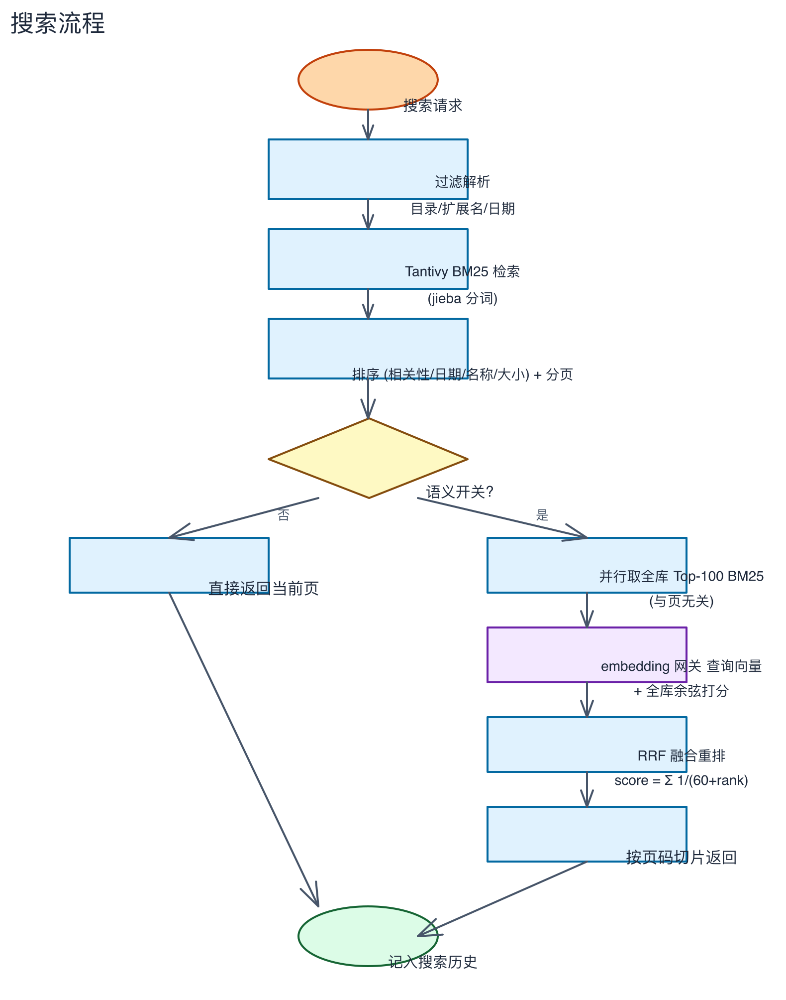

# 第四章：搜索入门

> 输入关键词、筛选结果、预览文件、导出数据。

---

## 步骤 1：进入搜索页面

点击左侧导航栏的「搜索」图标，进入搜索页面。

搜索页分为三个区域：
- **左侧**：筛选面板（目录树 + 文件类型）
- **中间**：搜索框 + 结果列表
- **右侧**：预览面板（空态时显示引导文字）

## 步骤 2：输入关键词搜索

1. 点击顶部的搜索框（或按 `⌘K` 快捷键聚焦）
2. 输入关键词，例如 `预算`（搜索演示资料库中的预算表）
3. 按 `Enter` 执行搜索

> 搜索结果会立即显示在下方列表中，包含：文件名、路径、内容摘要（关键词高亮）、评分、时间、大小。

## 步骤 3：使用筛选面板缩小范围

左侧筛选面板可帮助你精确控制搜索结果：

**目录筛选**：
- 展开目录树，勾选/取消勾选目录
- 只搜索选中的目录及其子目录
- 父目录与子目录联动——勾选父目录自动包含所有子目录

**文件类型筛选**：
- 勾选扩展名（.pdf, .docx, .png 等）
- 只搜索勾选格式的文件
- 取消勾选全部，则搜索所有格式

> 筛选条件会自动保存到浏览器本地存储，刷新页面不丢失。

## 步骤 4：预览文件内容

点击搜索结果中的任意一条，右侧预览面板会显示文件内容：

- **文件信息**：类型、大小、修改时间、完整路径
- **全文内容**：文档正文（最多显示 5 万字符）
- **PDF 标识**：显示 PDF 页码
- **图片缩放**：图片文件可缩放查看
- **文字计数**：显示文档字数

## 步骤 5：使用高级查询语法

搜索框支持丰富的查询语法，用于精确搜索：

| 语法 | 示例 | 说明 |
|------|------|------|
| 通配符 | `doc*` | 后缀匹配 — 匹配 document、docx 等 |
| 短语 | `"dog cat"` | 精确匹配 — 必须完全按顺序出现 |
| AND | `cat AND dog` | 两个词都必须包含 |
| OR | `cat OR dog` | 包含任一即可 |
| NOT | `cat NOT dog` | 排除包含 dog 的文档 |
| 分组 | `(cat OR dog) AND food` | 控制优先级 |
| 文件名 | `filename:report.pdf` | 按文件名搜索（正则匹配） |

> 注意：`*` 通配符只匹配后缀（如 `doc*`），不匹配前缀。

## 步骤 6：使用语义搜索

搜索框右侧的「✦ 语义」按钮可开启语义搜索——按"意思"而非仅按"字面"匹配。

**使用前提**：
1. 在设置页 → AI 标签页配置 Embedding 网关（见第六章）
2. 点击「测试连接」显示 ✓ 后才可用
3. 对已索引的历史文件，需要跑一次扫描补充向量

**用法**：
1. 点击「✦ 语义」按钮（按钮变蓝表示已开启）
2. 输入关键词搜索
3. 结果会混合关键词命中 + 语义相近的匹配

**对比**：

| | 普通搜索 | 语义搜索 |
|------|---------|---------|
| 匹配方式 | 字面包含 | 语义相近（向量） |
| 同义/近义 | 可能漏掉 | 能命中 |
| 模糊拼写 | 需模糊开关 | 自动容忍 |
| 速度 | 快 | 稍慢 |
| 前提 | 无需配置 | 需 Embedding 网关 |

## 步骤 7：排序结果

结果列表上方有排序下拉框，支持按以下方式排序：

- **相关性**（默认）：BM25 算法评分，最匹配的排在前面
- **日期**：按文件修改时间排序
- **文件名**：按文件名字母顺序
- **文件大小**：按文件大小排序

## 步骤 8：导出搜索结果

1. 点击结果列表上方的「导出」按钮
2. 在弹出的保存对话框中选择保存位置和文件名
3. 点击「保存」——搜索结果会导出为 CSV 文件
4. 用 Excel 或文本编辑器打开 CSV 文件查看

> 导出的 CSV 包含：文件名、路径、摘要、评分、时间、大小等信息。

## 步骤 9：使用键盘快捷键

| 操作 | 快捷键 |
|------|--------|
| 聚焦搜索框 | `⌘K` |
| 在结果中向上移动 | `↑` |
| 在结果中向下移动 | `↓` |
| 打开选中结果预览 | `Enter` |
| 搜索（焦点在框内） | `Enter` |

## 步骤 10：了解搜索流程（技术示意）

以下流程图展示了搜索请求从输入到返回结果的完整过程：

## ✅ 本章验证清单

- [ ] 已进入搜索页面
- [ ] 已输入关键词并看到搜索结果
- [ ] 已使用目录筛选缩小范围
- [ ] 已使用文件类型筛选
- [ ] 已点击结果查看预览面板
- [ ] 已尝试高级查询语法
- [ ] 已了解语义搜索功能
- [ ] 已尝试排序和导出
- [ ] 已使用键盘快捷键操作