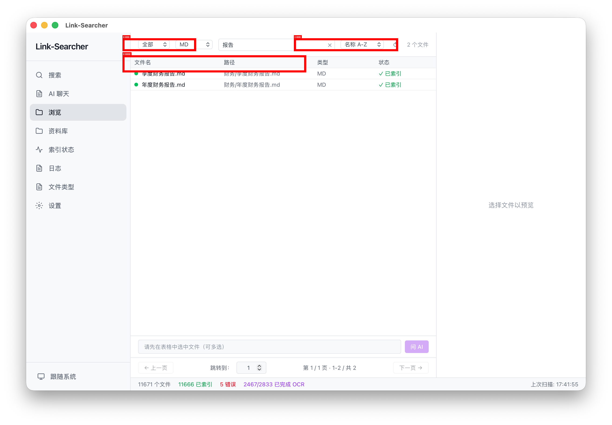

# 第五章：浏览文件

> 表格视图、状态筛选、右键菜单、批量操作。

---

## 步骤 1：进入浏览页面

点击左侧导航栏的「浏览」图标，进入文件浏览页面。

浏览页由**工具栏 + 文件表格 + 右侧预览面板**组成：
- **顶部工具栏**：搜索框、状态筛选、扩展名筛选、文件名搜索框、排序下拉框
- **中间**：文件列表（表格视图）
- **右侧**：预览面板（与搜索页共用）

## 步骤 2：使用状态筛选

文件列表上方有一个下拉选择器，按索引状态过滤文件：

| 选项 | 说明 | 标识 |
|------|------|:---:|
| 全部 | 显示所有文件 | — |
| 已索引 | 已成功提取文字并索引 | 🟢 绿色标记 |
| 待处理 | 排队等待索引 | 🟡 黄色标记 |
| 失败 | 索引失败 | 🔴 红色标记 |
| 已删除 | 软删除的文件（右键可恢复） | 🗑 标记 |
| 低质量 | 质量评分偏低的文件 | 🔴 红色质量标记 |

## 步骤 3：搜索和排序文件

**按文件名搜索**：
1. 文件列表上方的搜索框中输入文件名关键词
2. 列表会实时过滤，只显示匹配的文件

**按扩展名筛选**：
1. 点击搜索框旁边的扩展名下拉框
2. 选择要显示的扩展名（如 `.pdf`, `.docx`）

**排序**：
1. 点击工具栏的排序下拉框
2. 选择排序方式与方向：名称 A→Z / Z→A、大小升/降、修改时间新/旧、扩展名、质量升/降

> 表格列为：文件名、路径、类型、状态、质量，可拖动列边界调整列宽。

## 步骤 4：调整列宽

将鼠标悬停在表头两列之间的边界上：

1. 鼠标指针变为左右双向箭头
2. 按住左键左右拖动
3. 松开鼠标，列宽即调整完成

## 步骤 5：使用右键菜单

在文件列表的任意行上右键点击，弹出操作菜单：

| 菜单项 | 说明 |
|--------|------|
| 打开 | 用系统默认应用打开该文件（如 PDF 用预览打开） |
| 在文件夹中显示 | 在 Finder / 文件管理器中定位该文件 |
| 手动索引 | 重新索引该文件；已索引的文件会弹出确认框 |

## 步骤 6：多选文件

浏览页支持多选操作：

- **逐个选择**：按住 `Cmd`（macOS）或 `Ctrl`（Windows/Linux）并单击文件
- **区间选择**：点击第一个文件，按住 `Shift` 再点击最后一个文件
- 选中的文件行会高亮显示

## 步骤 7：批量重新索引

多选文件后：

1. 在选中的文件上右键
2. 选择「批量重新索引」
3. 确认后，所有选中文件会一次性提交重新索引

## 步骤 8：AI 问答（需配置 LLM）

多选文件后，底部会出现「问 AI」输入框：

1. 选中一个或多个文件
2. 在底部输入框中输入问题
3. 按 Enter 提交，AI 会基于选中文件的内容回答
4. 适合「对比多份合同」「总结这批材料」等场景

> 此功能需要先在设置页配置 LLM 模型（见第六章）。

## ✅ 本章验证清单

| 验证项 | E2E 覆盖 |
|--------|:--------:|
| ✅ 已进入浏览页面 | ✅ 页面加载 |
| ✅ 已使用状态筛选 | — |
| ✅ 已按文件名搜索文件 | — |
| ✅ 已使用排序下拉框排序 | — |
| ✅ 已调整列宽 | — |
| ✅ 已使用右键菜单 | — |
| ✅ 已尝试多选文件 | — |
| ✅ 已了解批量重新索引功能 | — |