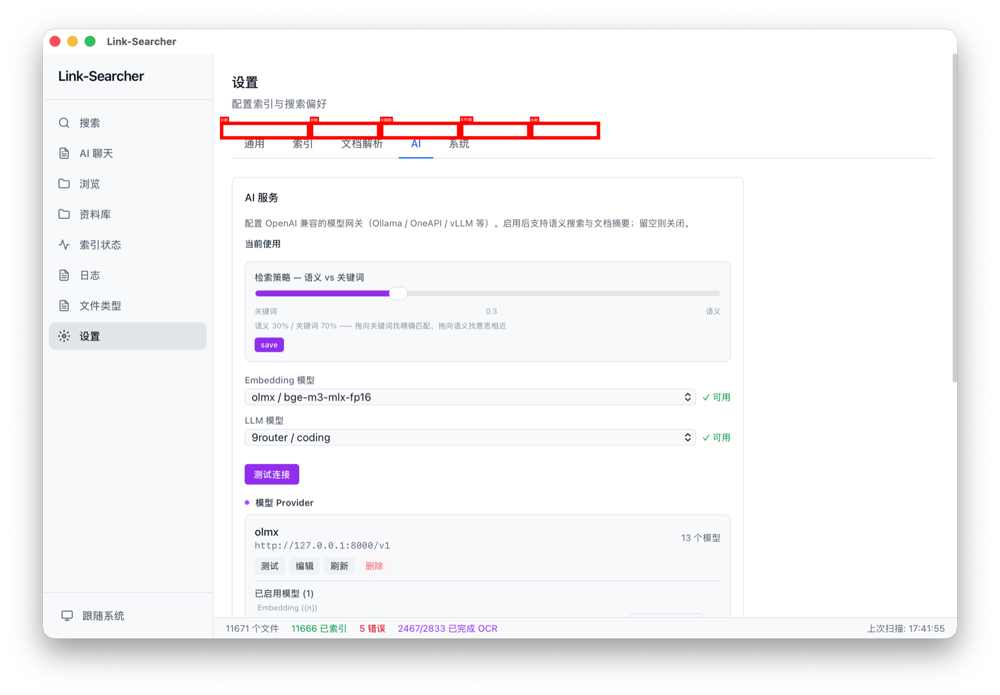

# 第六章：设置详解

> 通用 / 索引 / 依赖中心 / 文档解析 / AI / 备份 / 性能 / 系统 标签页逐项说明。

---

设置页分为多个标签页，所有选项**即时自动保存**，无需手动点击保存按钮。页面顶部显示标题「设置」和副标题「配置索引与搜索偏好」。

---

## 通用标签页

### 步骤 1：主题

从「主题」下拉选择框中选择模式：

- **浅色**：白底黑字，适合白天使用
- **深色**：黑底白字，适合夜间使用
- **跟随系统**：自动匹配系统主题设置

> 也可以通过左侧导航栏底部的主题按钮快速切换。按钮文字会随当前主题显示为「浅色」「深色」或「跟随系统」。

### 步骤 2：界面语言

从下拉菜单中选择界面语言：

- 中文
- English
- 日本語
- 한국어

选择后界面语言即时切换，无需重启。

### 步骤 3：数据目录与迁移

- **数据目录**：显示当前索引和数据库的存储路径
- **迁移数据**：点击后选择新目录，自动复制所有数据，然后重启生效

> 迁移前请确保目标目录有足够的磁盘空间。

### 初始化向导

「初始化向导」区块提供「重新运行向导」按钮，点击后重新打开首启向导（功能介绍 → 依赖检测/下载 → 准备就绪），便于引导新用户或补装运行依赖。

---

## 索引标签页

### 步骤 4：选择 OCR 引擎

| 引擎 | 说明 |
|------|------|
| PaddleOCR（默认） | PP-OCRv5 模型：发布版首次启动由「初始化依赖」向导下载（约 20MB，镜像），开发版用仓库内模型 |
| Windows OCR（Windows） | 系统原生；若缺语言包，列表会显示具体缺失并给补装指引 |
| Apple Vision（macOS） | 系统原生，无需安装 |
| Tesseract OCR | 备选引擎，需自行安装 `tesseract` CLI |

> 发布版若未安装模型，引擎列表会显示「未安装」并给出安装指引；也可前往「依赖中心」标签页安装。

### 步骤 5：测试 OCR 引擎

选择引擎后，点击「测试 OCR 引擎」按钮验证是否可用：

- 测试成功：显示 ✓ 绿色标记
- 测试失败：显示 ✗ 红色标记，需要检查安装

> 必须选择一个引擎并通过测试，才能开始索引。

### 步骤 6：设置 OCR 语言

选择 OCR 识别语言：

- `eng` — 英文
- `chi_sim` — 中文简体
- `jpn` — 日文
- `kor` — 韩文

> PaddleOCR 内置支持中英文混排识别，不受此设置影响。

---

## 依赖中心标签页

「依赖中心」集中列出所有可安装的运行依赖（PaddleOCR 模型、BGE-small 语义模型、FunASR 音频模型等），显示每项的安装状态（✓ 已安装 / ✗ 未安装）、说明与体积，并提供「立即安装」按钮和下载进度。顶部缺依赖提示条会直接跳转到此页。

---

## 文档解析标签页

文档解析标签页展示各格式的文本提取引擎状态，无需手动配置。

---

## AI 标签页

### 步骤 7：添加 AI Provider

1. 点击「添加 Provider」
2. 填写以下信息：
   - **名称**：给 Provider 起个标识名（如「本地 Ollama」）
   - **Base URL**：OpenAI 兼容网关地址（如 `http://127.0.0.1:11434/v1`）
   - **API Key**：网关密钥（本地服务可留空）
3. 点击「保存」——系统自动拉取模型列表

### 步骤 8：选择当前使用的模型

保存 Provider 后，模型会自动分类：

- **Embedding 模型**：用于语义搜索（如 `bge-m3-mlx-fp16`）
- **LLM 模型**：用于 AI 摘要、问答、聊天（如 `qwen2.5-7b-instruct`）
- **重排（Reranker）模型**：用于对检索结果重新排序（可选）

在「当前使用」下拉框中分别选择 Embedding、LLM 和重排（Reranker）模型。不选 = 对应功能停用。

### 步骤 9：管理 Provider

- **测试**：验证 Provider 连通性
- **刷新**：重新拉取模型列表（不影响手动分类）
- **编辑**：修改 Provider 配置
- **删除**：移除 Provider（正在使用的不可删除，需先切换模型）

### 步骤 10：测试连接

点击「测试连接」按钮，分别验证当前 Embedding 和 LLM 模型的连通性：

- ✓ 绿色：可用
- ✗ 红色：不可用，对应功能会自动禁用

---

## 性能标签页

性能标签页用于查看本机硬件信息并自动调优索引速度。

### 步骤 11：查看硬件信息

打开标签页时自动检测并展示：

- **CPU 核心数** — 决定并行工作线程上限
- **磁盘类型** — 自动基准测试后归类为 `NVME` / `SSD` / `HDD`
- **磁盘速度** — 2MB 临时文件读写的实测平均速度（MB/s）
- **操作系统** — 当前平台标识

### 步骤 12：一键优化

点击「⚡ 一键优化」按钮，系统根据检测到的硬件自动配置以下参数并立即生效（重启后保持）：

| 参数 | 说明 | 高性能档 | 均衡档 | 保守档 |
|------|------|:---:|:---:|:---:|
| 并行工作线程 | Phase 1 并发提取文件的线程数 | 24 | 12 | 4 |
| 提交间隔 | 每 N 个文件提交一次索引 | 2000 | 1000 | 500 |
| 写入缓冲区 | Tantivy writer 内存缓冲 | 300MB | 200MB | 150MB |

> 分档规则：≥16 核 + 快速盘 → 高性能；≥8 核 + 快速盘 → 均衡；其余（含 HDD、低配机）→ 保守。
> 索引过程中修改参数，下一批次即生效；正在处理的文件不受影响。

---

## 系统标签页

### 步骤 13：开机自启

开启后，Link-Searcher 随系统自动启动（macOS 使用 LaunchAgent，Windows 使用启动项）。

### 步骤 14：计划任务

- **定时扫描时间**：设置每日自动扫描的时间点（默认 `02:00`）
- **自动备份**：开启后按下方间隔自动备份索引数据到备份目录
- **备份间隔（天）**：备份周期，如 7 天
- **搜索结果上限**：单次搜索返回的最大结果数（默认 1000）。数值越大，搜索结果页可能越长。

### 步骤 15：排除模式

添加全局 glob 排除规则，适用于所有资料库。例如：

- `*.log` — 排除所有日志文件
- `node_modules/*` — 排除 node_modules
- `build/*` — 排除构建产物

> 这里的排除规则对所有资料库生效，与各目录的独立排除规则叠加。

### 步骤 16：Web API

- **启用 Web API**：开启后（需重启应用）以 `https://127.0.0.1:8443` 提供 Web 访问
- **开发模式**：代理到 Vite dev server（需先运行 `npm run dev`）
- **端口**：Web API 监听端口（默认 8443）
- **Bearer Token**：访问凭据，可点击「重新生成」
- **绑定地址**：局域网（`0.0.0.0`）或仅本机（`127.0.0.1`）

## ✅ 本章验证清单

| 验证项 | E2E 覆盖 |
|--------|:--------:|
| ✅ 已查看通用标签页（主题、语言） | ✅ 页面加载 + 主题切换 |
| ✅ 已查看索引标签页（OCR 引擎、语言） | ✅ OCR 设置项存在 |
| ✅ 已查看依赖中心标签页 | — |
| ✅ 已查看文档解析标签页 | — |
| ✅ 已了解如何添加 AI Provider | — |
| ✅ 已了解 Embedding / LLM / 重排模型的区别 | — |
| ✅ 已查看性能标签页并使用一键优化 | — |
| ✅ 已查看系统标签页 | ✅ 页面加载 |
| ✅ 已确认所有设置项自动保存 | ✅ 设置更新 IPC |
