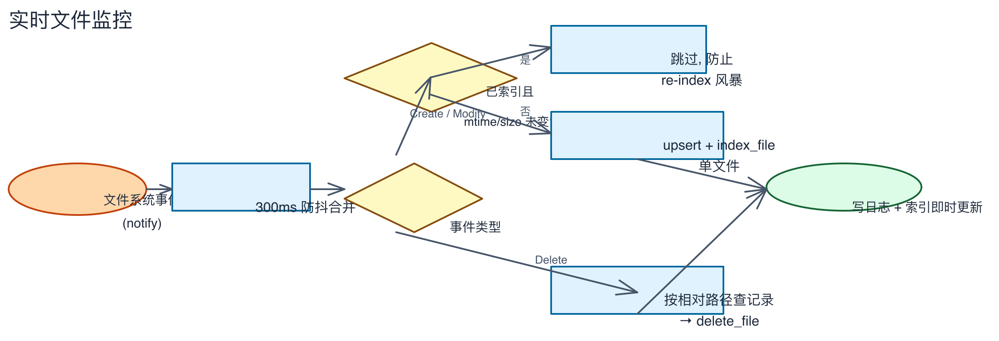

# 第七章：索引管理

> 扫描操作、任务简报、日志查看、文件类型分布。

---

## 步骤 1：查看索引状态

点击左侧导航栏的「索引状态」进入管理页面。


页面顶部显示标题「索引状态」和副标题「文档索引与扫描状态概览」。页面包含以下区域：

**统计卡片**：四张统计卡片分别显示：
- **文件总数**：资料库中的文件总量（如 `11,671`）
- **已索引**：成功提取文字并索引的文件数（如 `11,666`）
- **待处理**：尚未处理的文件数（如 `0`）
- **含错误**：处理失败的文件数（如 `5`），点击「详情」可查看错误列表

**OCR 识别进度**：显示 OCR 文字识别完成数，如 `2,467 / 2,833`，附带百分比进度。

**操作按钮**：页面顶部一排操作按钮：
- **「开始扫描」**：执行增量扫描
- **「✦ 补齐语义向量」**：为已索引文件生成 Embedding 向量（需配置 AI 网关后使用）
- **「↻ 重提取缺失内容」**：重新提取内容已丢失的文件
- **「含已标记文件」**：包含已标记需重新处理的文件
- **「✓ 验证索引有效性」**：检查索引与数据库的一致性
- **「重建索引」**：清空索引并重新全量扫描

**索引进度条**：显示当前完成百分比（如 `100%`），下方显示 Scan Info：
- **上次扫描**：最后扫描时间（如 `2026/8/14 06:19:47`）
- **状态**：当前扫描状态（如 `空闲`）
- **已索引总数**：如 `11666 / 11671`

**文件类型分布**：按文件格式列出数量和错误数。排序规则：数量从大到小，有错误的排在前面（显示红色错误计数）。例如：

| 格式 | 数量 | 错误 |
|-----|:----:|:----:|
| PDF | 5,753 | 1 |
| JPG | 2,298 | |
| Word | 1,977 | 1 |
| PNG | 525 | |
| ... | | |

**最近变更**：记录最近一次扫描的文件变更统计：
- **新增**：新发现的文件数（如 `+0`）
- **修改时间**：mtime 变化的文件数（如 `+0`）
- **删除**：已删除的文件数（如 `+0`）
- **错误**：新增的错误数（如 `+0`）

**重复文件**：显示重复文件检测结果（如「未发现重复文件」）。

**底部状态栏**：页面底部始终显示汇总信息，如：
```
11671 个文件 | 11666 已索引 | 5 错误 | 2467/2833 已完成 OCR | 上次扫描: 06:19:47
```

## 步骤 2：执行增量扫描

点击「开始扫描」按钮，执行增量扫描：

- 仅处理**新增和修改**的文件（对比 mtime 和上次扫描时间）
- 速度快，适合日常使用
- 扫描过程中状态栏会显示进度

## 步骤 3：执行全量扫描

如果需要重新扫描全部文件：

1. 点击「开始扫描」按钮旁的下拉箭头
2. 选择「全量扫描」
3. 确认后，系统会重新遍历所有目录的全部文件

> 全量扫描耗时较长，但能确保所有文件状态最新。

## 步骤 4：重建索引

如果需要从头构建索引：

1. 点击「重建索引」按钮
2. 确认对话框中选择「确定」
3. 系统会清空现有索引和数据库，重新全量扫描

> 重建索引会删除所有现有索引数据，需要重新处理所有文件。

## 步骤 5：取消扫描

扫描进行中时，可以随时取消：

1. 点击进度条旁的「取消」按钮
2. 当前扫描会安全停止
3. 已完成的索引数据不会丢失

## 步骤 6：使用长任务操作

以下操作适合在索引完成后执行：

| 操作 | 说明 | 适用场景 |
|------|------|----------|
| 验证索引有效性 | 检查索引与数据库的一致性 | 发现搜索结果异常时 |
| 补齐语义向量 | 为已索引文件生成 embedding 向量 | 刚配置完 AI 网关后 |
| 重提取缺失内容 | 重新提取内容已丢失的文件 | 存储损坏后 |

这些操作完成后，**底部状态栏的 📋 图标会点亮**，显示结果摘要。点击图标跳转到日志页对应位置。

## 步骤 7：查看文件类型分布

点击左侧导航栏的「文件类型」进入页面。页面显示关联的文件数量统计：

- 各格式文件数量统计（来自数据库真实数据）
- 依赖状态检查（如 OCR 引擎、音频模型）
- 支持的格式列表：PDF、Word、Excel、PPT、图片、Markdown、文本、代码、压缩包、音频
- 「扫描过但不支持」区块：展示无法识别的扩展名

## 步骤 8：查看日志


日志页面记录所有扫描和操作历史：

- 每次扫描生成独立日志文件
- 顶部筛选器支持按类型过滤（全部 / 索引 / OCR / 扫描 / 搜索 / 错误）
- 输入关键字可实时过滤日志内容
- 点击「刷新」获取最新日志
- 点击「清空」清除当前显示的日志（不影响已保存的日志文件）

## 步骤 9：了解实时文件监控

应用启动后会自动监控所有资料库目录的文件变更：



- 文件新增/修改后，300ms 防抖合并，自动索引
- 文件删除后，自动从索引中移除
- 无需手动操作，文件变更即时同步

## ✅ 本章验证清单

| 验证项 | E2E 覆盖 |
|--------|:--------:|
| ✅ 已查看索引状态页面 | ✅ 页面加载 + 统计信息 + 扫描按钮 |
| ✅ 已了解增量扫描和全量扫描的区别 | — |
| ✅ 已了解重建索引的作用 | — |
| ✅ 已查看文件类型分布页面 | ✅ 页面加载 |
| ✅ 已查看日志页面并尝试筛选 | ✅ 页面加载 |
| ✅ 已了解长任务操作和任务简报功能 | — |
| ✅ 已了解实时文件监控机制 | — |