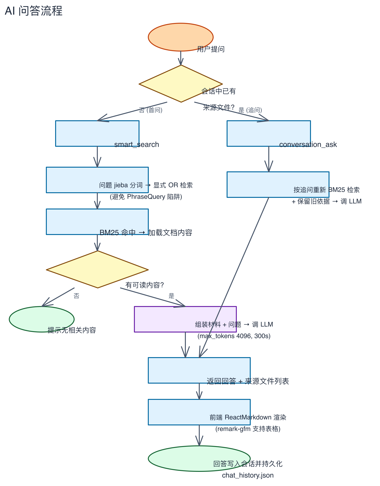

# 第八章：AI 增强功能

> 语义搜索、文档摘要、跨文件问答、AI 聊天。

---

## 前提：配置 AI 服务

AI 功能需要先配置 AI Provider（OpenAI 兼容网关）。详见第六章 AI 标签页。

**快速配置步骤**：
1. 进入设置 → AI 标签页
2. 添加 Provider（Ollama / OneAPI / vLLM 等均可）
3. 选择 Embedding 模型和 LLM 模型
4. 点击「测试连接」确认可用

> 未配置时，AI 功能按钮会自动置灰并给出提示，普通搜索不受影响。

---

## 步骤 1：使用语义搜索

配置 Embedding 后，搜索框右侧的「✦ 语义」按钮可用。

**启用语义搜索**：
1. 点击「✦ 语义」按钮（变蓝表示已开启）
2. 输入关键词搜索
3. 结果会混合两类匹配：关键词命中的 + 语义相近的

**对比效果**：

| 搜索方式 | 搜「欠费催缴」会命中 |
|----------|-------------------|
| 普通搜索 | 只含「欠费」「催缴」的文件 |
| 语义搜索 | 含「逾期未缴纳物业管理费」的文件也命中 |

**调节权重**：
- 设置页 → AI → 「检索策略」滑杆
- 拖向「语义」：找意思相近的结果
- 拖向「关键词」：找精确短语匹配
- 默认语义 30% / 关键词 70%

## 步骤 2：使用文档摘要

在预览面板中打开任意文档：

1. 搜索或浏览找到目标文件
2. 点击结果进入预览面板
3. 点击「✦ AI 摘要」按钮
4. 等待 LLM 生成摘要（自动缓存，再次打开秒回）

> 此功能依赖 LLM 模型。摘要缓存后，同一文档再次打开无需重新生成。

## 步骤 3：使用跨文件问答

1. 进入浏览页面
2. 多选一个或多个文件（Cmd/Ctrl+单击）
3. 底部出现「问 AI」输入框
4. 输入问题，按 Enter 提交
5. AI 基于选中文件的内容回答

**适合场景**：
- 「对比这几份合同的条款差异」
- 「总结这批文件的主要内容」
- 「找出所有文件中提到的金额」

> 此功能依赖 LLM 模型。

## 步骤 4：使用 AI 聊天

AI 聊天页提供多轮对话式文档检索。页面分为两个区域：
- **左侧面板**：会话列表 + 文件树浏览器
- **右侧**：聊天面板（消息区域 + 输入框）

### 左侧面板：会话管理

**会话列表**：顶部显示标题「会话」，列出所有历史对话。每条会话显示用户第一条消息的前 20 个字作为标题。点击切换会话，悬停显示删除按钮。

**文件树浏览器**：会话列表下方有「文件树 ▸」按钮，点击展开后显示所有资料库目录。目录旁的「范围」按钮可将该目录加入当前会话的检索范围（再次点击清除全部范围）；目录和文件可点击展开，**右键任意文件或目录可将其加入检索范围**。

### 基本对话

1. 点击左侧导航栏的「AI 聊天」
2. 首次进入时自动创建一个新会话，输入框提示文字为「继续追问…」
3. 在输入框中输入问题，点击「发送」按钮或按 Enter 发送
4. 系统自动检索相关文档，LLM 基于找到的资料回答
5. 输入框清空，等待 AI 响应时显示「思考中」和已用时间（如 `00:05`）
6. 响应完成后显示回答内容，底部显示耗时（如 `⏱ 5秒`）
7. 可以继续追问，系统会重新检索并保留对话上下文

### 控制检索范围

**检索范围**是一个跨轮累计的路径集合——你主动加入的文件/目录会一直生效，直到手动 × 删除。所有入口最终都汇入这同一个范围：

| 方式 | 操作 | 示例 |
|------|------|------|
| 右键加入 | 文件树中**右键**任意文件或目录 | 右键 `财务/预算.xlsx` |
| @ 文件 | 输入 `@` 弹出文件选择器，选中即插入路径 | `@财务/预算.xlsx 汇总收入` |
| @ 目录 | 同上，选择目录 | `@财务 本季度收入` |
| 条件命令 | 输入 `/ext:pdf` 或 `/date:2025-01-01~2025-12-31` | `/ext:pdf 年度报告` |
| 范围命令 | 输入 `/范围:目录名` 或 `/范围:全库` | `/范围:财务` |
| 严格模式 | 开启「仅依据文档」开关，引用文件必须在依据中（缺失/歧义/未索引报错） | 范围内无命中时拒绝回答，旧来源不混入 |

**范围条**：输入框上方显示当前会话已累计的范围条目（合并后，📄 文件 / 📁 目录），逐条可点击 × 删除；无范围时显示「未限制（全库）」。全库条目（`""` 空串）的 × 会清空整个范围为 `[]`。

**跨轮累计**：本轮的 @引用（chips）发送后自动并入会话范围，下一轮继续生效，直到手动删除。

**父目录吞并子路径**：当范围同时包含 `A` 和 `A/B` 时，自动合并为 `A`（父目录已覆盖其全部内容），避免检索被无谓收窄。同理，全库条目（空串 `""`）会吸收所有子路径——`["", "X"] → [""]`。

**范围快照**：每一轮发送时的完整范围会被记录，导出会话时可逐轮追溯该轮实际检索了哪些路径。空串条目（`""`）在导出中显示为「全库」。

**严格模式（仅依据文档）详情**：开启后，检索行为更加严格：
- 引用文件必须在检索依据中——即使问题文本与引用文件内容零词重叠，引用文件仍必须出现
- 缺失/歧义/未索引的引用路径会报错：找不到文件、无法唯一匹配、文件无可用内容
- 旧来源文件不混入本轮结果（`from_history` 被排除）
- 范围内无命中时拒绝回答「未在与当前范围匹配的文档中找到依据」

### 查看检索依据

每条 AI 回答下方有可折叠的「🔍 检索依据（N）」面板，展示该轮回答引用的文档详情：

- 每份来源文件的 BM25 评分
- 语义相似度分数（如配置了 Embedding）
- RRF 融合排序分
- 改写标记（查询被改写时显示「改写」标签，附原始改写查询）
- 来源文件路径（点击可打开文件）
- 内容片段（snippet）

### 编号引用

`@文件` 在发送给 LLM 前替换为 `[N]` 编号，回答中引用精确：

> 根据[1]、[2]统计总人数，并根据[3]计算平均身高。

### 其他操作

- **导出**：聊天面板顶部「导出」按钮，将会话导出为 Markdown 文件
- **取消回答**：AI 响应中可点击「取消」终止生成
- **仅依据文档**：输入框下方开关，开启后引用文件必须在检索依据中出现，缺失/歧义/未索引路径会报错，旧来源不混入，范围内无命中时拒绝回答（绿色激活态）
- **全量召回**：输入框下方开关，决定 BM25 自动检索到的非引用文档注入 LLM 的数量（关闭时最多 30 份，开启时全部注入，紫色激活态）。详见下方「全量召回与内容截断」说明。

### 全量召回与内容截断

AI 问答在将文档内容注入 LLM 时，受限于上下文窗口大小和性能，会进行多层截断。如果回答遗漏了关键信息，可能是以下原因：

| # | 阶段 | 舍弃什么 | 条件 | 如何避免 |
|---|------|---------|------|---------|
| 1 | 引用文档 | 引用文档总内容超过 50k 字符时截断 | 引用文档内容很大 | 减少引用文档数量，或引用更聚焦的章节 |
| 2 | BM25 命中 | 非引用文档最多注入 30 份全文 | **全量召回关闭**（默认） | 开启「全量召回」 |
| 3 | BM25 命中 | 每份文档按字数预算（总预算/命中数）截断 | 命中数多，单份配额变少 | 缩小检索范围或开启全量召回 |
| 4 | 摘要 | 超出 60 份的剩余命中不做摘要 | 命中数 > 90 | 缩小检索范围或开启全量召回 |
| 5 | 总长度 | 所有材料拼起来后截断到 50k（关闭）或 140k（开启）字符 | 始终存在 | 缩小检索范围，聚焦关键文档 |
| 6 | 语义扫描 | 超出 500 条的语义命中被丢弃 | **全量召回关闭**（默认） | 开启「全量召回」 |

**关键结论**：

- **引用文档（@文件）始终注入，不受命中数限制，但受总长度（50k）截断**
- **全量召回只影响非引用文档的注入数量，不影响引用文档**——即使引用 50 份文档，也全部注入
- 最容易遗漏的场景：引用的文档本身内容极长（如几百页 PDF），超过 50k 字符的关键内容被截断
- 开启「全量召回」可以消除 #2、#6 的遗漏，但 #1、#3、#4、#5 仍存在

## 步骤 5：了解 AI 问答流程

以下流程图展示了 AI 问答从提问到回答的完整过程：

## 隐私提示

启用 AI 功能后，文档文本会发送到您配置的网关：

- 使用本地 Ollama（`127.0.0.1`）：内容不出本机
- 使用云端服务：文档内容会经 API 发送
- 不配置：AI 功能自动隐藏，其他功能不受影响

## ✅ 本章验证清单

| 验证项 | E2E 覆盖 |
|--------|:--------:|
| ✅ 已配置 AI Provider | —（需手动配置） |
| ✅ 已测试连接通过 | ✅ AI 能力探测 IPC |
| ✅ 已尝试语义搜索 | ✅ 语义入口存在 |
| ✅ 已尝试文档摘要 | — |
| ✅ 已尝试跨文件问答 | — |
| ✅ 已进入 AI 聊天页面 | ✅ 页面加载 |
| ✅ 已发送问题并等待 AI 回答 | ✅ 流式对话全链路 |
| ✅ 已查看检索依据面板 | ✅ 证据面板展开 + 内容验证 |
| ✅ 已了解隐私保护机制 | — |