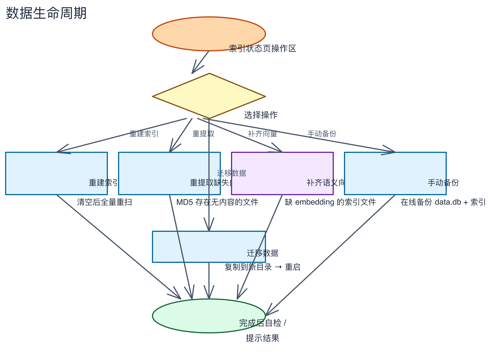

# 第九章：数据备份与迁移

> 存储位置、手动备份、自动备份、迁移数据、跨平台索引。

---

## 步骤 1：了解数据存储位置

Link-Searcher 的所有数据存储在本地：

| 平台 | 数据目录 |
|------|---------|
| macOS | `~/Library/Application Support/link-searcher/` |
| Windows | `%APPDATA%\link-searcher\` |
| Linux | `~/.local/share/link-searcher/` |

目录内容：

| 文件/目录 | 说明 |
|-----------|------|
| `data.db` | SQLite 数据库（文件追踪、配置、AI 会话等） |
| `index/` | Tantivy 搜索引擎索引文件 |
| `app.log` | 应用运行日志 |
| `backups/` | 自动备份存储目录 |
| `models/funasr/` | FunASR 语音识别模型 |

> FunASR 模型只需下载一次，升级重装后仍在。开发版（`npm run tauri dev`）优先从项目目录读取，打包版只认数据目录。

## 步骤 2：手动备份

1. 进入索引状态页面
2. 点击「手动备份」按钮
3. 系统会在线备份 `data.db` + 索引目录到备份位置
4. 备份完成后，状态栏会显示结果

## 步骤 3：配置自动备份

1. 进入设置 → 系统标签页
2. 开启「自动备份」开关
3. 设置备份间隔天数（如 7 天）
4. 系统会按间隔自动创建备份

> 备份存储在数据目录的 `backups/` 子目录中。

## 步骤 4：迁移数据

如果需要将数据迁移到新位置：

1. 进入设置 → 通用标签页
2. 点击「数据目录」旁的「迁移数据」按钮
3. 在弹出的对话框中选择目标目录
4. 系统自动复制所有数据到新目录
5. 复制完成后，应用自动重启并使用新目录

> 迁移前请确保目标目录有足够的磁盘空间（至少为原数据体积的 1.5 倍）。

## 步骤 5：了解跨平台索引

文件路径在数据库和索引中存储为**相对路径**（相对于监控目录根），而非绝对路径。

这意味着：
- 两个完全同步的目录在不同操作系统上可共享同一份索引数据
- 例如：macOS 上索引的目录，复制到 Windows 后可直接使用
- 适合在多个设备间共享索引

## 步骤 6：了解数据生命周期

以下流程图展示了索引状态页各种操作对应的数据生命周期：

## ✅ 本章验证清单

- [ ] 已了解数据存储位置
- [ ] 已尝试手动备份
- [ ] 已配置自动备份
- [ ] 已了解数据迁移功能
- [ ] 已了解跨平台索引原理